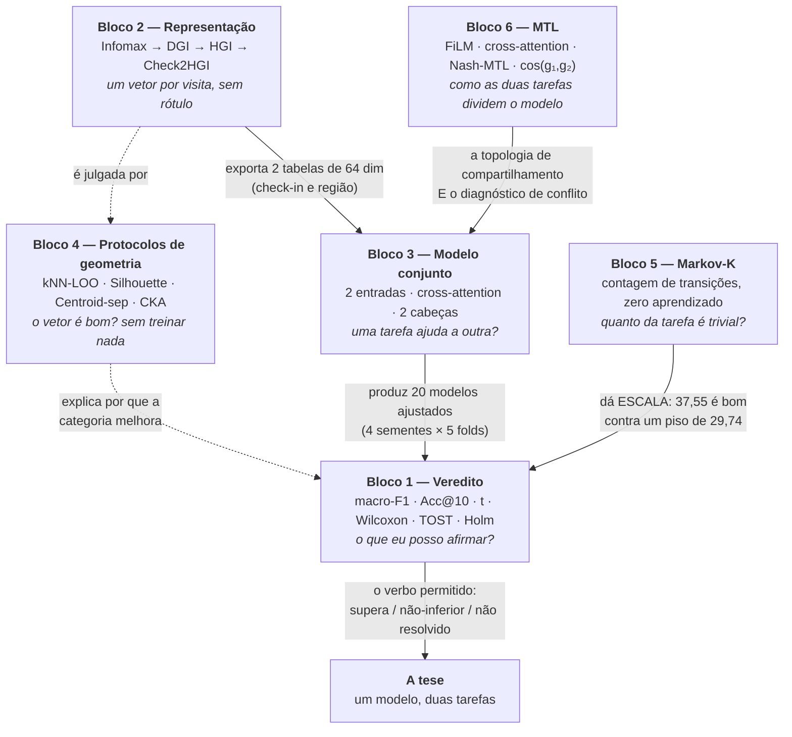
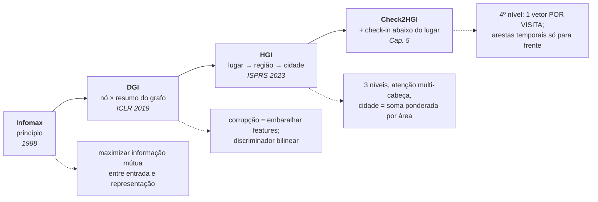
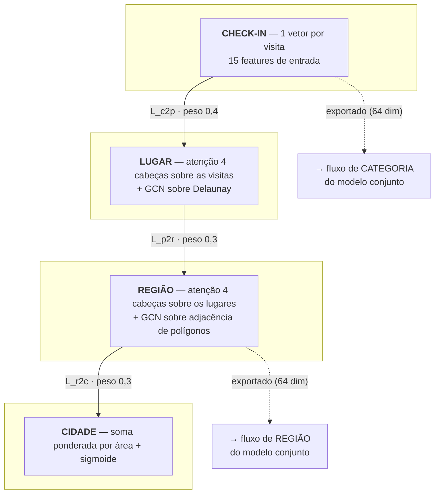
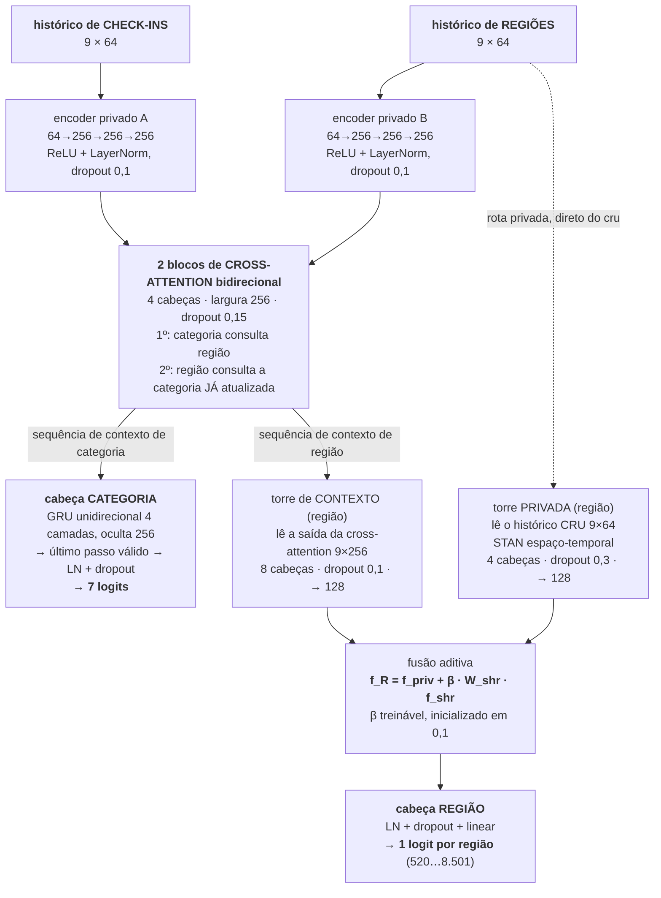
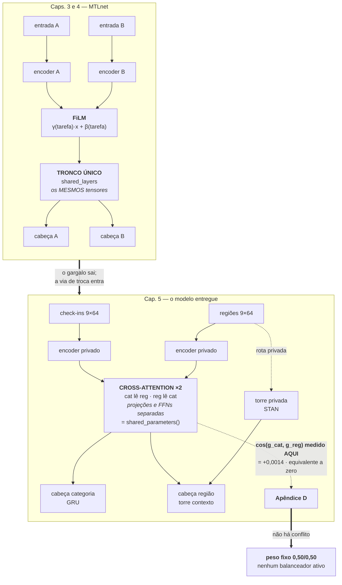

# Estudos para a Defesa — guia didático

> **O que é este documento.** Uma explicação em português, do zero, dos conceitos listados na seção
> **"Estudos específicos"** de [`Questions_author.md`](Questions_author.md). Cada bloco responde três
> perguntas na mesma ordem: **o que é**, **como funciona**, e **por que isso importa nesta
> dissertação**. Nada aqui é texto entregue — é material de estudo para a arguição de **2026-08-28**.
>
> **Como ler.** Os seis blocos são independentes. Dá para ler o bloco 3 sem ter lido o 1. O
> [Mapa](#0--mapa-como-as-seis-frentes-se-ligam) mostra como eles se conectam.
>
> **Como este documento cresce.** Toda seção termina com um espaço fixo chamado
> **"Dúvidas e esclarecimentos"**. Quando você voltar com uma pergunta sobre Infomax, a resposta
> entra em [§2.7](#27--dúvidas-e-esclarecimentos), datada, sem reescrever o resto. O
> [Registro de tópicos](#b--registro-de-tópicos) no fim é o índice vivo: tópicos novos entram lá
> primeiro e viram seção depois. Instruções de expansão em
> [§C](#c--como-pedir-uma-seção-nova-ou-uma-resposta).

**Última atualização:** 2026-08-26 · **Blocos cobertos:** 6 de 6 dos "Estudos específicos"
(Markov-K em 2026-08-25; MTL — FiLM, cross-attention, Nash-MTL, cosseno dos gradientes — em 2026-08-26)

> **Duas seções de estudo rápido**, para quem já leu uma vez: **[A.1](#a1--cada-termo-em-uma-frase--para-dizer-em-voz-alta)**
> traz cada termo do documento em **uma frase para dizer em voz alta**, e
> **[A.2](#a2--o-desenho-do-todo-numa-página)** é o **desenho do todo numa página**, do check-in cru
> até o veredito.

---

## Índice

- [0 · Mapa: como as seis frentes se ligam](#0--mapa-como-as-seis-frentes-se-ligam)
- [1 · Métodos estatísticos](#1--métodos-estatísticos)
  - [1.1 macro-F1](#11--macro-f1) · [1.2 Acc@10](#12--acc10-o-par-da-outra-tarefa) · [1.3 A unidade de análise](#13--a-unidade-de-análise-o-que-é-um-número-pareado-aqui) · [1.4 Teste t pareado](#14--o-teste-t-pareado-a-pergunta-melhorou) · [1.5 Wilcoxon](#15--wilcoxon-dos-postos-com-sinal) · [1.6 TOST](#16--tost-a-pergunta-é-igual-ou-não-é-pior) · [1.7 Holm](#17--holm-o-preço-de-perguntar-seis-vezes) · [1.8 Cola de bolso](#18--cola-de-bolso-do-bloco-1) · [1.9 Dúvidas](#19--dúvidas-e-esclarecimentos)
- [2 · Infomax, DGI, HGI e Check2HGI](#2--infomax-dgi-hgi-e-check2hgi)
  - [2.1 A ideia Infomax](#21--a-ideia-infomax) · [2.2 DGI](#22--dgi-infomax-em-grafo) · [2.3 HGI](#23--hgi-a-hierarquia-lugarregiãocidade) · [2.4 Check2HGI](#24--check2hgi-o-quarto-nível) · [2.5 Quadro comparativo](#25--quadro-comparativo-da-linhagem) · [2.6 Por que importa](#26--por-que-isso-importa-na-dissertação) · [2.7 Dúvidas](#27--dúvidas-e-esclarecimentos)
- [3 · O modelo conjunto](#3--o-modelo-conjunto-joint-model)
  - [3.1 O caminho do dado](#31--o-caminho-do-dado-em-cinco-estágios) · [3.2 Camada a camada](#32--camada-a-camada-com-justificativa) · [3.3 A perda](#33--a-função-de-perda-e-o-ajuste-de-logits) · [3.4 Otimização](#34--otimização-três-grupos-um-backward) · [3.5 Seleção de checkpoint](#35--seleção-de-checkpoint-o-que-é-um-modelo-implantável) · [3.6 Tabela de hiperparâmetros](#36--tabela-de-hiperparâmetros-de-referência) · [3.7 Dúvidas](#37--dúvidas-e-esclarecimentos)
- [4 · Protocolos de comparação de embeddings](#4--protocolos-de-comparação-de-embeddings)
  - [4.1 O problema](#41--o-problema-como-julgar-um-vetor-sem-treinar-nada) · [4.2 kNN-LOO](#42--knn-loo) · [4.3 Silhouette](#43--silhouette-com-distância-de-cosseno) · [4.4 Centroid separability](#44--centroid-separability-ratio) · [4.5 Linear CKA](#45--linear-cka) · [4.6 A ressalva](#46--a-ressalva-mais-importante-deste-bloco) · [4.7 Dúvidas](#47--dúvidas-e-esclarecimentos)
- [5 · Markov-K, o modelo de referência](#5--markov-k-o-modelo-de-referência)
  - [5.1 Cadeia de Markov](#51--o-que-é-uma-cadeia-de-markov) · [5.2 A ordem K e o *backoff*](#52--markov-k-a-ordem-k-e-o-stupid-backoff) · [5.3 A curva de K](#53--o-resultado-e-a-curva-que-ele-desenha) · [5.4 O piso de região](#54--o-piso-markov-1-de-região) · [5.5 Por que importa](#55--por-que-isso-importa-na-dissertação) · [5.6 Dúvidas](#56--dúvidas-e-esclarecimentos)
- [6 · MTL: FiLM, Cross-Attention, Nash-MTL e o cosseno dos gradientes](#6--mtl-film-cross-attention-nash-mtl-e-o-cosseno-dos-gradientes)
  - [6.1 O problema do MTL](#61--o-problema-que-o-mtl-cria) · [6.2 FiLM](#62--film--como-o-mtlnet-compartilhava-caps-3-e-4) · [6.3 Cross-Attention](#63--cross-attention--como-o-modelo-entregue-compartilha-cap-5) · [6.4 Nash-MTL](#64--nash-mtl--o-remédio-que-a-literatura-oferece) · [6.5 O cosseno dos gradientes](#65--o-cosseno-dos-gradientes--o-diagnóstico) · [6.6 O desenho do todo](#66--como-os-quatro-se-ligam--o-desenho-do-todo) · [6.7 Dúvidas](#67--dúvidas-e-esclarecimentos)
- [A · Cola de bolso geral](#a--cola-de-bolso-geral)
  - [A.1 Cada termo em uma frase](#a1--cada-termo-em-uma-frase--para-dizer-em-voz-alta) · [A.2 O desenho do todo](#a2--o-desenho-do-todo-numa-página) · [A.3 As sete frases](#a3--as-sete-frases-que-amarram-a-dissertação-inteira) · [A.4 A escada de verbos](#a4--a-escada-de-verbos) · [A.5 Números](#a5--números-que-não-podem-sair-errado)
- [B · Registro de tópicos](#b--registro-de-tópicos)
- [C · Como pedir uma seção nova](#c--como-pedir-uma-seção-nova-ou-uma-resposta)
- [D · Fontes](#d--fontes)

---

## 0 · Mapa: como as seis frentes se ligam

Os blocos não são assuntos soltos. Eles são **estágios de uma mesma frase**:

> *"Uma **representação** melhor (bloco 2), medida por **protocolos de geometria** (bloco 4),
> alimenta um **modelo conjunto** (bloco 3) cujo **compartilhamento** não gera conflito (bloco 6),
> com uma vantagem que só pode ser afirmada pelo **veredito estatístico** correto (bloco 1) — e que
> só é legível contra um **piso** (bloco 5)."*



**A leitura em uma frase por bloco:**

| Bloco | A pergunta que ele responde | O erro que ele evita |
|---|---|---|
| **2 — Representação** | Como descrever uma visita sem usar o rótulo do futuro? | Usar um vetor fixo por lugar, que não distingue terça de manhã de sábado à noite |
| **4 — Geometria** | Esse vetor é melhor, e *por quê*? | Atribuir ao modelo um ganho que era da entrada |
| **3 — Modelo conjunto** | Duas tarefas podem dividir um modelo sem se atrapalhar? | Reportar duas épocas diferentes como se fossem um sistema só |
| **1 — Estatística** | O que a evidência autoriza a dizer? | Ler "não deu significativo" como "são iguais" |
| **5 — Markov-K** | Quanto disso se resolve só contando? | Reportar um número sem dizer contra o que ele é bom |
| **6 — MTL** | Como duas tarefas dividem um modelo sem brigar? | Supor conflito de gradiente em vez de medir |

---

## 1 · Métodos estatísticos

> **Referência na dissertação:** Cap. 2 §"Metrics and reference points" e §"Comparison and
> statistical decisions"; Cap. 5 §"Metrics and statistical tests" (`05_setup.tex`).

### A ordem certa de aprender isto

Há uma tentação de estudar TOST, Wilcoxon e Holm como três testes numa lista. Eles não são isso.
Eles respondem a **três perguntas diferentes**, e a dissertação usa cada um exatamente porque
os outros dois não serviriam:

```
                        Você quer afirmar o quê?

    "o meu é MELHOR"      "o meu NÃO É PIOR"        "eu perguntei 6 vezes"
           |                      |                          |
     teste t pareado            TOST                       Holm
     (+ Wilcoxon como       (dois testes                (correção da
      análise de robustez)    unilaterais)             família de testes)
           |                      |                          |
     Cap. 5, categoria      Cap. 5, região            aplicado nos dois,
     (e as 2 células           (4 células)            separadamente
      de região)
```

E antes dos três, as **métricas** — porque um teste estatístico não julga um modelo, ele julga
*a diferença entre dois números*. Quais números são esses é o que macro-F1 e Acc@10 definem.

---

### 1.1 · macro-F1

#### O que é

Comece pelo tijolo: para **uma** classe (digamos, `Nightlife`), o modelo acerta e erra de quatro
jeitos.

```
                        REALIDADE
                   Nightlife   não é Nightlife
              ┌──────────────┬──────────────────┐
     modelo   │      VP      │        FP        │   ← "eu disse Nightlife"
   diz que é  │  (acertou)   │  (falso alarme)  │
   Nightlife  ├──────────────┼──────────────────┤
   modelo diz │      FN      │        VN        │
   que não é  │  (deixou     │   (acertou o     │
              │   passar)    │      não)        │
              └──────────────┴──────────────────┘
```

Duas razões saem daí:

$$P_c = \frac{VP}{VP + FP} \qquad\text{(precisão: das que eu chamei de } c\text{, quantas eram?)}$$

$$R_c = \frac{VP}{VP + FN} \qquad\text{(revocação: das que eram } c\text{, quantas eu peguei?)}$$

Elas se contrapõem. Um modelo covarde que só chama de `Nightlife` o caso obviíssimo tem precisão
alta e revocação baixa. Um modelo afoito tem o contrário. O **F1** é a média harmônica das duas,
que é a média que **pune o desequilíbrio**:

$$F1_c = \frac{2 P_c R_c}{P_c + R_c}$$

> **Por que harmônica e não aritmética?** Com $P = 1{,}0$ e $R = 0{,}02$, a média aritmética dá
> $0{,}51$ — parece meio bom. A harmônica dá $0{,}039$. A harmônica é dominada pelo menor dos dois,
> que é exatamente o comportamento que se quer: não adianta ser preciso se você não pega quase nada.

E o **macro**-F1 é a média simples dos sete F1, **um por categoria**:

$$\operatorname{MacroF1} = \frac{1}{C}\sum_{c=1}^{C} \frac{2P_cR_c}{P_c+R_c}, \qquad C = 7$$

#### Como funciona, na prática

```python
import numpy as np

def macro_f1(y_true, y_pred, n_classes=7):
    f1s = []
    for c in range(n_classes):
        vp = np.sum((y_pred == c) & (y_true == c))
        fp = np.sum((y_pred == c) & (y_true != c))
        fn = np.sum((y_pred != c) & (y_true == c))
        p = vp / (vp + fp) if (vp + fp) else 0.0
        r = vp / (vp + fn) if (vp + fn) else 0.0
        f1s.append(2 * p * r / (p + r) if (p + r) else 0.0)
    return float(np.mean(f1s))          # média SIMPLES — a classe rara pesa igual
    # (sklearn: f1_score(y_true, y_pred, average="macro"))
```

A linha que decide tudo é a última: `np.mean(f1s)`. A alternativa — **micro**-F1, ou acurácia — soma
os VP/FP/FN de todas as classes *antes* de dividir, e aí a classe grande manda.

#### Por que isso importa nesta dissertação

Porque **Food é cerca de um terço dos check-ins em todos os seis conjuntos** (24,7% na Flórida,
34,2% no Alabama). Sob acurácia simples, um modelo que só responde "Food" já começa com ~30%, e
um ganho de verdade nas classes pequenas fica invisível.

O piso comparável em macro-F1 é brutalmente diferente. Sempre responder a classe majoritária dá
**entre 5,7 e 7,3 macro-F1**, porque o modelo zera as seis outras classes. Esse é o número que
ancora a escala: quando o modelo conjunto marca **37,55 na Flórida**, isso é contra um piso de ~7,
não contra um piso de ~25.

```
macro-F1 na Flórida — escala real

 piso (classe majoritária)  ▓▓▓▓                                     ~7,0
 Markov-K                   ▓▓▓▓▓▓▓▓▓▓▓▓▓▓▓▓▓                        29,74
 POI-RGNN                   ▓▓▓▓▓▓▓▓▓▓▓▓▓▓▓▓▓▓▓▓                     34,49
 dedicado (uma tarefa)      ▓▓▓▓▓▓▓▓▓▓▓▓▓▓▓▓▓▓▓▓▓▓                   37,35
 conjunto (duas tarefas)    ▓▓▓▓▓▓▓▓▓▓▓▓▓▓▓▓▓▓▓▓▓▓                   37,55  ↑
                            └────┴────┴────┴────┴────┴────┴────┴────┘
                            0    5   10   15   20   25   30   35   40
```

#### O que a métrica **não** faz — e a banca pode perguntar

1. **Não diz qual classe melhorou.** Um ganho de +0,19 pode ser toda a melhora concentrada em
   `Nightlife` ou espalhada por sete classes. A macro-F1 é surda para isso.
2. **Pode ser baixa com acurácia alta**, e é justamente o caso aqui: 37 de macro-F1 convive com uma
   acurácia bem mais alta, porque as classes pequenas puxam a média para baixo.
3. **Ela premia a fronteira balanceada, e a perda não é reponderada.** O treino usa entropia cruzada
   **sem peso de classe** — no Cap. 5, ponderar por classe piorou tanto a macro-F1 de categoria
   quanto a acurácia de região. O ajuste vem por outro caminho (o *logit adjustment*,
   [§3.3](#33--a-função-de-perda-e-o-ajuste-de-logits)).

---

### 1.2 · Acc@10 (o par da outra tarefa)

Categoria tem 7 classes. **Região tem de 520 a 8.501.** Exigir o acerto exato da região em primeiro
lugar num vocabulário de 8.501 seria medir quase só ruído. Então a métrica é de **ranking**:

$$\operatorname{Acc@10} = \frac{1}{N}\sum_{i=1}^{N} \mathbb{I}\!\left[y_i \in \operatorname{Top10}(\hat{\mathbf{p}}_i)\right]$$

Em português: *"em que fração das visitas de teste a região correta apareceu entre as dez mais bem
pontuadas?"*. O chute aleatório num vocabulário de 520 regiões acerta ~1,9%; nos maiores, muito menos.

**Três detalhes que aparecem em arguição:**

- **Não distingue 1º de 10º lugar.** Um modelo que sempre põe a certa em 10º empata com um que
  sempre põe em 1º.
- **Região ausente do treino conta como erro.** Não é descartada — é contabilizada contra o modelo.
- **A versão reportada é descontada por OOD** (*out-of-distribution*): mede-se a Acc@10 nas visitas
  cuja região existe no treino e multiplica-se por $(1 - \text{fração fora de distribuição})$. É a
  leitura honesta, não a otimista.

> **Por que duas métricas diferentes e não uma nota só?** Porque as tarefas não são comparáveis.
> A dissertação **nunca** soma ou média as duas num "desempenho do modelo". O único lugar onde elas
> se encontram é a **seleção de checkpoint** ([§3.5](#35--seleção-de-checkpoint-o-que-é-um-modelo-implantável)),
> e lá elas entram por média **geométrica**, não aritmética.

---

### 1.3 · A unidade de análise: o que é um "número pareado" aqui

Este é o ponto que mais confunde, e sem ele os três testes seguintes não fazem sentido.

O experimento do Cap. 5 tem duas camadas de repetição:

```
 SEMENTE (seed)  ─ define a partição dos usuários E a inicialização do modelo
   │              4 sementes: {0, 1, 7, 100}
   │
   ├── fold 1 ─┐
   ├── fold 2  │  5 partições disjuntas POR USUÁRIO
   ├── fold 3  │  (todas as janelas de um usuário ficam do mesmo lado)
   ├── fold 4  │
   └── fold 5 ─┘
                        4 × 5 = 20 modelos ajustados por configuração
```

E aí vem a regra de agregação, que é onde muita gente erra ao ler a tabela:

> **Primeiro** faz-se a média dos 5 folds **dentro** de cada semente. **Depois** faz-se a média das
> 4 médias-por-semente. O **±** impresso é o desvio-padrão **entre as 4 médias-por-semente**, não
> entre os folds.

Consequência direta: a análise primária é um teste pareado com **n = 4**, não n = 20. Isso parece
pouco — e é —, mas é a unidade honesta, porque os 5 folds de uma mesma semente não são
independentes entre si (eles particionam o mesmo sorteio de usuários).

**O que "pareado" significa aqui:** dentro de uma mesma semente, o modelo conjunto e o modelo
dedicado veem **exatamente a mesma partição de usuários**. Então a diferença
$d_s = \text{conjunto}_s - \text{dedicado}_s$ elimina a variação que vem do sorteio. É a mesma lógica
de medir dois remédios no mesmo paciente em vez de em pacientes diferentes.

```python
# a estrutura real do dado que entra nos testes
import numpy as np

joint    = np.array([37.61, 37.48, 37.55, 37.56])   # média dos 5 folds, por semente
dedicated= np.array([37.41, 37.29, 37.37, 37.33])   # idem, mesma partição
d = joint - dedicated                                # n = 4 diferenças pareadas
#  ^ TODO teste do Cap. 5 opera sobre este vetor (ou sobre as 20 diferenças por fold)
```

---

### 1.4 · O teste t pareado (a pergunta "melhorou?")

#### O que é

A hipótese nula é *"a diferença média verdadeira é zero"*. O teste pergunta: **se ela fosse zero, com
que frequência eu veria uma diferença tão grande quanto a que vi, só por sorte?** Essa frequência é
o valor de $p$.

$$t = \frac{\bar{d}}{s_d/\sqrt{n}}, \qquad n = 4,\ \ \text{gl} = 3$$

onde $\bar{d}$ é a média das diferenças pareadas e $s_d$ o desvio-padrão delas. O numerador é
"quanto mudou"; o denominador é "quanto isso oscila". O $t$ é a razão entre sinal e ruído.

```python
from scipy import stats
t, p_bilateral = stats.ttest_rel(joint, dedicated)      # equivalente a ttest_1samp(d, 0)
p_unilateral = p_bilateral / 2 if t > 0 else 1 - p_bilateral / 2
```

#### Por que também se reporta o intervalo de confiança de 90%

Porque o $p$ diz apenas *"é distinguível de zero?"*. O **intervalo** diz *"de que tamanho é?"* — e é
o tamanho que a dissertação usa para limitar as afirmações. Exemplo entregue, na categoria:

```
Diferenças conjunto − dedicado, categoria (macro-F1), IC 90%

 FL   ├──┤                    +0,19   [+0,14 , +0,25]   ✔ sobrevive a Holm (p = 0,011)
 IST  ├────┤                  +0,08   [+0,01 , +0,15]   não resolvido
 AZ  ├──┤                     −0,00   [−0,04 , +0,03]   não resolvido
 CA  ├─┤                      −0,00   [−0,03 , +0,02]   não resolvido
 TX ├───┤                     −0,13   [−0,19 , −0,08]   não resolvido
 AL ├──────┤                  −0,19   [−0,33 , −0,04]   não resolvido
     ┴────┴────┴────┴────┴────┴
   −0,4  −0,2   0   +0,2  +0,4          (o mais distante de zero: 0,34, no AL)
```

A leitura que a dissertação faz disso: nenhum intervalo chega a meio ponto de zero. Logo, **todas as
seis diferenças de categoria estão dentro de meio ponto**, simultaneamente. Isso é um limite *lido do
intervalo*, não um teste adicional — e é por isso que o texto não diz "empata", diz "dentro de meio
ponto".

#### Por que importa nesta dissertação

O teste t é o que autoriza o verbo **"supera"**. A lei de redação do projeto é explícita: *supera*
fica reservado a teste pareado de superioridade. Os Caps. 3 e 4 não têm teste nenhum — só médias e
desvios — e por isso **não podem** usar esse verbo. Só o Cap. 5 pode.

---

### 1.5 · Wilcoxon dos postos com sinal

#### O que é

Uma alternativa ao teste t que **não assume normalidade**. Em vez de usar os valores das diferenças,
usa a **ordem** delas.

Receita:

```
1. Descarte as diferenças exatamente iguais a zero.
2. Ordene as diferenças pelo MÓDULO e atribua postos 1, 2, 3, ...
3. Devolva o sinal a cada posto.
4. Some os postos positivos (W+) e os negativos (W−).
5. Se o tratamento não tem efeito, W+ e W− deviam ser parecidos.
```

Exemplo com as 4 diferenças de semente:

```
 d      = [ +0,21 ,  −0,05 ,  +0,18 ,  +0,23 ]
 |d|    = [  0,21 ,   0,05 ,   0,18 ,   0,23 ]
 posto  = [    3  ,     1  ,     2  ,     4  ]
 sinal  = [   +3  ,    −1  ,    +2  ,    +4  ]
 W+ = 9   W− = 1     →  quase tudo positivo, mas com n = 4...
```

```python
from scipy import stats
stat, p = stats.wilcoxon(joint, dedicated, alternative="greater")
```

#### O detalhe que a banca pode cobrar — e a dissertação já responde

Com $n = 4$ diferenças, os sinais têm $2^4 = 16$ configurações igualmente prováveis sob a nula. A
mais extrema (todas positivas) tem probabilidade $1/16$. Ou seja:

> **Com n = 4, o menor valor-p unilateral que o Wilcoxon exato pode produzir é 0,0625** — acima de
> 0,05. **Nenhum resultado seria significativo, por construção.**

É por isso que a dissertação **inverte a ordem declarada no plano**: o plano registrava o Wilcoxon
como teste primário; a análise final usa o **t pareado sobre as 4 médias-por-semente** como primário
e reporta o Wilcoxon sobre as **20 diferenças por fold** como **análise de sensibilidade**. Os dois
chegam às mesmas decisões, e o desvio em relação ao plano está declarado no texto e no código.

**Como responder isso em pé, em duas frases:** *"O plano registrou Wilcoxon. Com quatro sementes, o
Wilcoxon exato tem p mínimo de 0,0625, então ele não podia decidir nada nesse pé. Reportei o t
pareado como primário, o Wilcoxon sobre os vinte folds como sensibilidade, os dois concordam, e o
desvio está declarado."*

---

### 1.6 · TOST (a pergunta "é igual?", ou "não é pior?")

Este é o conceito mais importante do bloco 1, e o mais mal compreendido na literatura em geral.

#### O erro que o TOST existe para corrigir

> **Ausência de significância NÃO é evidência de igualdade.**

Um $p$ alto pode significar duas coisas completamente diferentes:

```
   p = 0,42   ┌─ (a) a diferença é realmente ~zero
              └─ (b) a diferença pode ser enorme, mas o experimento é fraco demais
                     para detectar (poucos dados, muito ruído)

   O teste de superioridade NÃO distingue (a) de (b).
```

Se o argumento da dissertação é *"o modelo conjunto **não piora** a região"*, um $p$ não
significativo não serve como prova. Seria construir uma afirmação positiva sobre um fracasso de
detecção.

#### Como o TOST resolve

**Inverte as hipóteses.** Em vez de "a nula é igualdade e eu tento rejeitá-la", o TOST faz de
**"a diferença é grande"** a hipótese nula, e tenta rejeitá-la.

Escolhe-se antes uma **margem $\delta$** — a menor diferença que ainda importaria na prática. Aqui,
$\delta = 2$ pontos de Acc@10, **registrada antes de qualquer resultado ser lido**. Então rodam-se
**dois testes unilaterais** (daí o nome, *two one-sided tests*):

$$H_{01}: \mu_d \le -\delta \quad\text{(é pior por mais de 2)} \qquad H_{02}: \mu_d \ge +\delta \quad\text{(é melhor por mais de 2)}$$

Se **os dois** forem rejeitados, o que sobra é $-\delta < \mu_d < +\delta$: a diferença está **dentro
da margem**. Isso é equivalência.

Para **não-inferioridade** — que é o caso da dissertação — basta o primeiro teste: rejeitar
*"é pior por mais de 2 pontos"*.

```
      pior por muito        DENTRO DA MARGEM         melhor por muito
   ────────────────────┬───────────────────────┬────────────────────
                      −δ           0          +δ
                     (−2)                    (+2)

   Alabama, região:        ├────┤                     −0,87  [−1,00 , ...]
                        o intervalo inteiro cabe dentro da margem  →  ≈ (não-inferior)
```

#### O atalho prático: o TOST se lê do intervalo de confiança

Este é o truque que vale ouro numa arguição:

> **Se o intervalo de confiança de 90% da diferença estiver inteiramente contido em
> $[-\delta, +\delta]$, o TOST a 5% é aprovado.** Não precisa rodar teste nenhum — está na tabela.

(A dualidade é exata: dois testes unilaterais a $\alpha$ = 5% correspondem a um intervalo bilateral
de $100 - 2\times5 = 90$%. É por isso que o Cap. 5 imprime IC de **90%**, e não de 95%.)

```python
# TOST de não-inferioridade, na mão — n = 4
from scipy import stats
import numpy as np

d, delta = joint - dedicated, 2.0
t_stat = (d.mean() + delta) / (d.std(ddof=1) / np.sqrt(len(d)))
p_ni    = 1 - stats.t.cdf(t_stat, df=len(d) - 1)     # H0: mu <= -delta
# equivalente: checar se o limite INFERIOR do IC 90% > -delta
```

#### Por que $\delta = 2$, e por que isso é defensável

A justificativa é **de domínio, não estatística**: um serviço sensível a mobilidade age sobre *qual
região vai ficar cheia*, não sobre uma posição específica do ranking. Uma mudança de 2 pontos em
Acc@10 está abaixo do nível em que esse serviço se comportaria de outro jeito.

E o texto é honesto sobre a folga: o desvio-padrão da diferença pareada entre as quatro partições vai
de 0,02 a 0,16 ponto. Istambul, Arizona e Flórida têm intervalos estreitos o bastante para suportar
uma margem de **1 ponto**. O Alabama não — e é justamente o conjunto com a maior diferença de região
($-0{,}87$).

#### Onde o TOST entra e onde **não** entra

| Eixo | Margem registrada? | Verbo permitido |
|---|---|---|
| **Região** (Acc@10) | **Sim**, $\delta = 2$ pontos, pré-registrada | "não-inferior" nas 4 células ≈; "supera" em TX e CA |
| **Categoria** (macro-F1) | **Não** | Uma diferença que falha na superioridade é **"não resolvida"** — nunca "empata", nunca "igual". O limite de meio ponto é **lido dos intervalos**, não estabelecido por teste |

Essa assimetria é deliberada e é a armadilha número um do Cap. 5. Dizer "empata na categoria" seria
afirmar equivalência sem margem registrada.

---

### 1.7 · Holm (o preço de perguntar seis vezes)

#### O problema

Cada teste a $\alpha = 5$% tem 5% de chance de dar um falso positivo. Faça **seis** testes
independentes e a chance de **pelo menos um** falso positivo vira:

$$1 - (1 - 0{,}05)^6 = 26{,}5\%$$

Um em cada quatro estudos com seis comparações "encontraria" um resultado que não existe. Como o Cap.
5 tem seis conjuntos de dados, e portanto seis comparações por eixo, isso não é hipotético.

```
 chance de ao menos um falso positivo, sem correção

  1 teste   ▓▓                       5,0 %
  2 testes  ▓▓▓▓                     9,8 %
  4 testes  ▓▓▓▓▓▓▓                 18,5 %
  6 testes  ▓▓▓▓▓▓▓▓▓▓              26,5 %   ← o caso desta dissertação
 12 testes  ▓▓▓▓▓▓▓▓▓▓▓▓▓▓▓▓▓▓▓▓▓   46,0 %   ← se os dois eixos fossem uma família só
```

#### Como o Holm funciona

O Bonferroni clássico divide $\alpha$ por $m$ e pronto — simples, e conservador demais. O
**Holm (1979)** é um procedimento **descendente** (*step-down*) que controla o mesmo erro
família-a-família, mas com mais poder:

```
1. Ordene os p do MENOR para o MAIOR:   p(1) ≤ p(2) ≤ ... ≤ p(6)
2. Compare p(1) com α/6.  Rejeitou? siga.  Não rejeitou? PARE — nada mais é rejeitado.
3. Compare p(2) com α/5.  Rejeitou? siga.  Não? PARE.
4. Compare p(3) com α/4.  ... e assim por diante, até α/1.
```

O limiar vai **afrouxando** conforme você desce. O primeiro teste enfrenta a barra de Bonferroni; o
último enfrenta $\alpha$ inteiro. Por isso Holm **domina uniformemente** Bonferroni: rejeita tudo que
Bonferroni rejeita, e às vezes mais, sem custo de garantia.

```python
from statsmodels.stats.multitest import multipletests
rej, p_corrigido, _, _ = multipletests(p_brutos, alpha=0.05, method="holm")
```

#### Por que importa nesta dissertação

Duas decisões finas, e as duas podem ser cobradas:

1. **São duas famílias, não uma.** A correção é aplicada **separadamente** nas seis comparações de
   categoria e nas seis de região. Juntar as doze numa família só seria mais conservador do que a
   pergunta exige — os dois eixos são afirmações independentes, com métricas diferentes.
2. **O Holm é o que dá crédito aos vereditos que sobraram.** As células marcadas com ↑ são as que
   sobrevivem a ele:

| Eixo | Sobrevive ao Holm | $p$ corrigido |
|---|---|---|
| Categoria | **Flórida**, $+0{,}19$ | $0{,}011$ — 19 dos 20 folds a favor |
| Região | **Texas**, $+1{,}21$ | $0{,}00013$ — 20 dos 20 folds |
| Região | **Califórnia**, $+1{,}06$ | $< 10^{-4}$ — 20 dos 20 folds |

> **Nota fina, e ela é uma vulnerabilidade honesta:** o plano de análise registrou superioridade para
> **categoria** e não-inferioridade para **região**. Os dois ganhos de região são portanto
> **resultados secundários, fora do plano** — e o texto diz isso. Se a banca perguntar "esses dois
> ganhos de região valem?", a resposta é: valem como observação, não como teste pré-registrado.

---

### 1.8 · Cola de bolso do bloco 1

| Ferramenta | Pergunta | Nula | Quando usar | No Cap. 5 |
|---|---|---|---|---|
| **macro-F1** | Quão bem em **todas** as 7 classes? | — | Rótulo desbalanceado | Eixo categoria; piso 5,7–7,3 |
| **Acc@10** | A certa está entre as 10 primeiras? | — | Vocabulário enorme (520–8.501) | Eixo região; descontada por OOD |
| **t pareado** | É **melhor**? | $\mu_d = 0$ | Afirmar ganho | Primário, $n=4$ médias-por-semente |
| **IC 90%** | De que **tamanho**? | — | Limitar a afirmação | Impresso em toda célula; dual do TOST |
| **Wilcoxon** | É melhor, sem supor normal? | mediana $=0$ | Robustez | Sensibilidade, $n=20$ folds |
| **TOST** | **Não é pior** que $\delta$? | $\lvert\mu_d\rvert \ge \delta$ | Afirmar equivalência | Região, $\delta=2$ pp, pré-registrada |
| **Holm** | Perguntei 6 vezes; e daí? | — | Família de testes | Separado por eixo |

**As três frases que não podem sair errado:**

1. *"Um resultado não significativo não é evidência de igualdade — por isso existe o TOST."*
2. *"A margem de dois pontos foi registrada antes de qualquer resultado ser lido, e só para região."*
3. *"Na categoria não há margem registrada, então uma diferença que falha na superioridade é **não
   resolvida**, e o limite de meio ponto é lido dos intervalos."*

---

### 1.9 · Dúvidas e esclarecimentos

> *Espaço reservado. Perguntas suas sobre o bloco 1 e as respostas entram aqui, cada uma com data.*

<!-- MODELO — copie e preencha
#### 1.9.N · [pergunta em uma linha] · <data>
**Pergunta.**

**Resposta.**

**Onde isso aparece na dissertação.**
-->

*(nenhuma entrada ainda)*

---

## 2 · Infomax, DGI, HGI e Check2HGI

> **Referência na dissertação:** Cap. 2 §"Representations for mobility" (`2_fundamentals.tex`);
> Apêndice E, "How Check2HGI and the Joint Model Work" (`apx_h_check2hgi_joint_model.tex`).

Esta é a linhagem que a sua própria fala de defesa (slide S8) resume numa frase. Vale começar por ela,
porque as quatro seções seguintes são só o detalhamento dela:

> **A ideia Infomax, numa frase:** *o modelo aprende vetores úteis sendo obrigado a distinguir um
> pareamento verdadeiro de um pareamento corrompido, e não precisa de rótulo nenhum para isso, porque
> os próprios dados dizem qual é o verdadeiro.*



---

### 2.1 · A ideia Infomax

#### O princípio

**Infomax** vem de Linsker (1988), em neurociência computacional: um sistema de processamento deveria
escolher a transformação que **maximiza a informação mútua** entre a entrada e a saída. Traduzindo:
*se eu vou comprimir 15 números em 64, comprima de um jeito que preserve o máximo possível do que
havia na entrada.*

A **informação mútua** entre duas variáveis mede quanto saber uma reduz a incerteza sobre a outra:

$$I(X;Z) = \mathbb{E}_{p(x,z)}\!\left[\log \frac{p(x,z)}{p(x)\,p(z)}\right]$$

Se $X$ e $Z$ forem independentes, $p(x,z) = p(x)p(z)$, o log é zero e $I = 0$. Quanto mais a
distribuição conjunta se afasta do produto das marginais, maior a informação mútua.

#### O problema, e o truque que o resolve

$I(X;Z)$ é **intratável** em alta dimensão — exigiria conhecer densidades que não temos. A solução da
década de 2010 foi trocar o cálculo por uma **estimativa variacional**: em vez de calcular $I$,
treina-se um **discriminador** para separar amostras da conjunta $p(x,z)$ (pares **reais**) de
amostras do produto $p(x)p(z)$ (pares **corrompidos**). Quanto melhor ele separa, maior é o limite
inferior de $I$.

- **MINE** (Belghazi et al., 2018) formalizou isso com a representação de Donsker–Varadhan.
- **Deep InfoMax / DIM** (Hjelm et al., 2019) mostrou que, na prática, o que funciona não é maximizar
  $I$ globalmente, e sim entre **partes locais** da entrada e um **resumo global** — e que um
  substituto simples de classificação binária (Jensen–Shannon) treina melhor que o limite exato.

**Este é o pulo do gato pedagógico:** *"maximizar informação mútua"* vira, na prática,
*"treinar um classificador que distingue par verdadeiro de par falso"*. É uma tarefa supervisionada
comum — só que o rótulo ("este par é verdadeiro") vem da **estrutura dos dados**, não de anotação
humana. Por isso é **auto-supervisão**, e por isso nenhum rótulo de tarefa entra.

```python
import torch, torch.nn as nn

class BilinearDiscriminator(nn.Module):
    """D(e1, e2) = sigma(e1^T W e2) — o coração de DGI, HGI e Check2HGI."""
    def __init__(self, dim=64):
        super().__init__()
        self.W = nn.Parameter(torch.empty(dim, dim))
        nn.init.xavier_uniform_(self.W)

    def forward(self, e1, e2):                       # [N, d], [N, d]
        return torch.sigmoid((e1 @ self.W * e2).sum(-1))   # [N] em (0, 1)

def infomax_loss(D, e_pos_a, e_pos_b, e_neg_b):
    """Par verdadeiro perto de 1, par corrompido perto de 0."""
    return -(torch.log(D(e_pos_a, e_pos_b) + 1e-8).mean()
             + torch.log(1 - D(e_pos_a, e_neg_b) + 1e-8).mean())
```

> **Por que bilinear e não um MLP?** Porque $\mathbf{e}_1^\top \mathbf{W} \mathbf{e}_2$ é **linear em
> cada embedding quando o outro está fixo**. Isso mantém a pressão do gradiente sobre a *geometria*
> dos vetores em vez de deixar um discriminador poderoso "resolver" o problema sozinho e liberar os
> embeddings para serem qualquer coisa. É uma escolha de contenção deliberada.

---

### 2.2 · DGI (Infomax em grafo)

#### O que é

**Deep Graph Infomax** (Veličković et al., ICLR 2019) leva o DIM para grafos. A pergunta que ele
treina é: *"este nó pertence a este grafo, ou eu o peguei de um grafo embaralhado?"*

```
                    GRAFO REAL                     GRAFO CORROMPIDO
                 ┌───────────────┐                ┌───────────────┐
    features     │  X  (N × F)   │                │  X̃  = X com   │
                 │               │                │  as LINHAS    │
                 │  A  (N × N)   │                │  embaralhadas │
                 └───────┬───────┘                └───────┬───────┘
                         │  encoder GNN                   │  MESMO encoder
                         ▼                                ▼
              h_1 ... h_N  ("patches")           h̃_1 ... h̃_N
                         │
                         ▼  readout (média + sigmoide)
                    s  = resumo GLOBAL do grafo
                         │
                         ▼
             D(h_i, s) → 1                    D(h̃_j, s) → 0
```

O objetivo é a entropia cruzada binária padrão:

$$\mathcal{L} = -\frac{1}{N+M}\left(\sum_{i=1}^{N}\log \mathcal{D}(\mathbf{h}_i, \mathbf{s}) + \sum_{j=1}^{M}\log\left(1 - \mathcal{D}(\tilde{\mathbf{h}}_j, \mathbf{s})\right)\right)$$

#### O detalhe que faz funcionar

A **função de corrupção** embaralha as linhas de $X$ **mantendo a matriz de adjacência $A$**. Isso é
cirúrgico: o nó corrompido tem features que não combinam com a vizinhança dele. Para um nó
sobreviver ao discriminador, o encoder é obrigado a produzir uma representação que **concilia** a
feature do nó com a estrutura em volta dele. É daí que sai a qualidade.

#### Por que importa nesta dissertação

O DGI é o **primeiro degrau** da linhagem: fornece o objetivo e os embeddings de lugar do
**Capítulo 3** (CBIC). É o piso a partir do qual tudo o mais se mede.

---

### 2.3 · HGI (a hierarquia lugar–região–cidade)

#### O que é

**Hierarchical Graph Infomax** (Huang et al., *ISPRS J. Photogramm. Remote Sens.*, 2023) observa que
uma cidade não é um grafo plano. Ela tem **níveis aninhados**: um POI está numa região, uma região
está numa cidade. O DGI compara duas escalas (nó × grafo). O HGI compara **três**, em cascata.

```
                        ┌─────────────┐
                        │   CIDADE    │   soma das regiões ponderada por ÁREA
                        └──────┬──────┘
                     objetivo região ↔ cidade
                        ┌──────┴──────┐
                        │   REGIÃO    │   atenção multi-cabeça sobre os POIs
                        └──────┬──────┘
                     objetivo POI ↔ região
                        ┌──────┴──────┐
                        │     POI     │   GCN sobre grafo de Delaunay
                        └─────────────┘
```

**Como cada nível é construído:**

1. Um **encoder de categoria pré-treinado** fornece as features iniciais de cada POI.
2. **Uma camada** de convolução em grafo sobre uma **triangulação de Delaunay** dos POIs da área
   adiciona contexto espacial. Os pesos das arestas **decaem com a distância** e são **reduzidos
   ainda mais quando os dois POIs estão em regiões diferentes**.
3. **Atenção multi-cabeça** agrega os POIs de uma região num vetor de região.
4. Uma **soma ponderada por área** sobre as regiões produz um vetor de cidade.

#### Duas consequências que a dissertação explora — e que a banca pode perguntar

**(a) O POI do HGI já é "consciente da região".** O treino atualiza o encoder de POI, a agregação e
o encoder de região **juntos**, e o objetivo empurra o POI a pontuar alto contra a **própria** região
e baixo contra as outras. A pertença à região entra ainda antes disso, pelos pesos das arestas. Ou
seja: **o vetor de POI do HGI não é uma descrição do lugar isolado** — ele já reflete a região.

**(b) O HGI foi projetado para outra coisa.** Os experimentos originais avaliam **o vetor de região**
(distribuição funcional urbana, densidade populacional, preço de imóvel, em Xiamen e Shenzhen). O
vetor de POI é um **estágio interno** para chegar lá. Esta dissertação **reaproveita** essa saída de
nível-POI para predição sequencial — um uso que a avaliação original não cobre. Isso está declarado
no texto, e é a resposta honesta a *"você está usando o HGI fora do escopo dele?"*: sim, e está dito.

**(c) Um hiperparâmetro foi re-ajustado, e só ele.** Huang et al. reduzem a aresta entre POIs de
regiões diferentes para **0,4** do peso. Esse valor não foi transferido sem teste: nos dados desta
dissertação, sobre os mesmos cinco folds, **0,7** deu a melhor F1 de categoria e foi adotado.
⚠ **O que isso resolve é um hiperparâmetro da linha de base. Não é evidência sobre HGI vs. Check2HGI.**

#### Por que importa nesta dissertação

O HGI é (i) a representação do **Capítulo 4** (CoUrb), (ii) a **linha de base de nível-lugar** contra
a qual o Check2HGI é medido no Cap. 5, e (iii) a **base direta** do Check2HGI — que é o HGI mais um
nível.

---

### 2.4 · Check2HGI (o quarto nível)

#### A limitação que ele ataca

Uma frase resolve:

> Numa representação de nível-lugar, **uma manhã de terça-feira e uma noite de sábado no mesmo lugar
> têm entradas idênticas**. É o mesmo vetor.

Isso é fatal para a tarefa de próxima categoria. O que distingue uma visita que acontece minutos
depois da anterior de uma visita que abre uma saída nova é o **tempo decorrido** — e um vetor por
lugar não consegue carregar isso, porque é o mesmo vetor em toda visita.

#### O que o Check2HGI faz

Adiciona um **quarto nível, abaixo do lugar: o check-in**. Um vetor **por visita**.



**As 15 features de entrada de cada check-in** — e cada grupo tem uma razão:

| Grupo | Quantos | O que é | Por quê |
|---|---:|---|---|
| Categoria | 7 | *one-hot* das 7 categorias do lugar visitado | A categoria entra como **entrada**, nunca como alvo |
| Tempo cíclico | 4 | seno e cosseno da hora do dia; seno e cosseno do dia da semana | Faz 23h e 0h ficarem **vizinhos** no espaço de features, em vez de opostos numa escala linear |
| Tempo decorrido | 4 | tempo desde a visita anterior; tempo desde a primeira visita do usuário (ambos em log); intervalo dentro do mesmo dia; indicador de primeira visita | O log põe "minutos" e "semanas" em escala comparável; o indicador cobre a primeira visita, que não tem "anterior" |

**Coordenadas não entram nesse vetor.** Elas determinam a pertença ao polígono, as arestas de
Delaunay e a adjacência entre regiões — atuam pela **estrutura do grafo**, não pela feature.

#### As arestas, e a que evita o vazamento

Três formas de estrutura:

- **Sucessão de check-ins.** Visitas consecutivas do mesmo usuário, **numa direção só, do passado
  para o futuro**, com peso que decai exponencialmente com o intervalo (constante de decaimento de
  1 hora).
- **Vizinhanças espaciais.** Delaunay entre lugares próximos; regiões ligadas quando os polígonos se
  tocam.
- **Pertença hierárquica.** check-in → lugar → região → cidade.

> ⚠️ **A direção da aresta é a decisão de integridade mais importante do método.** Um alvo é predito a
> partir do **passado** do usuário; então a representação construída para esse alvo é construída
> **só a partir do passado**, no treino **e** na leitura. Foi exatamente o fechamento desse
> vazamento (`src < tgt`, "forward-only") que separou a geração v17 da v18 — e no Alabama o vazamento
> valia **28,63 pontos de macro-F1**. É por isso que todo número de categoria entregue vive na faixa
> 30–38, e não nos 60–79 de antes.

#### Os cinco termos da perda

$$\mathcal{L}_{\mathrm{Check2HGI}} = 0{,}4\,\mathcal{L}_{C\!P} + 0{,}3\,\mathcal{L}_{P\!R} + 0{,}3\,\mathcal{L}_{R\Omega} + 0{,}3\,\mathcal{L}_{\mathrm{mp}} + 0{,}1\,\mathcal{L}_{\mathrm{anc}}$$

| Termo | Peso | O que faz | Como o negativo é gerado |
|---|---:|---|---|
| $\mathcal{L}_{C\!P}$ | 0,4 | check-in ↔ lugar onde ocorreu | outro lugar |
| $\mathcal{L}_{P\!R}$ | 0,3 | lugar ↔ região dele | outra região, **parte da amostragem mirando regiões moderadamente parecidas** (senão a tarefa fica trivial) |
| $\mathcal{L}_{R\Omega}$ | 0,3 | região ↔ resumo da cidade | permutar as linhas de feature dos check-ins e refazer o *forward*, **preservando a topologia temporal** |
| $\mathcal{L}_{\mathrm{mp}}$ | 0,3 | esconde 15% dos lugares e reconstrói a distribuição de categorias deles a partir dos vizinhos de Delaunay | — |
| $\mathcal{L}_{\mathrm{anc}}$ | 0,1 | penaliza o afastamento excessivo da tabela de lugares inicializada | — |

Os pesos são **fixos, de projeto, e não somam 1** — isso é intencional e está dito no texto.

#### O corte de gradiente (`detach`) que quase ninguém nota

Na rota espacial superior, a representação agregada do lugar é **destacada** (`detach`). Consequência:
os objetivos lugar–região e região–cidade **não conseguem** reescrever o encoder de check-in pelo ramo
espacial. O nível de check-in continua aprendendo pelo objetivo check-in–lugar, que é o dele.

**Traduzindo a intenção:** impede que perdas geográficas de alto nível sequestrem a representação
temporal da visita — sem, com isso, impedir a rota espacial de aprender.

#### Treino e exportação

```
Adam full-batch · lr 1e-3 · 500 épocas · weight decay 0 · clip 0,9 · semente 42
Estado salvo: a época de MENOR perda total de treino (não há validação aqui — não há rótulo)
                              │
                              ▼
      Exporta DUAS tabelas de 64 dimensões, e elas ficam CONGELADAS:
        • um vetor por CHECK-IN   → fluxo de categoria
        • um vetor por REGIÃO     → fluxo de região
```

⚠️ **As duas tabelas são separadas e continuam separadas.** O modelo conjunto recebe duas matrizes
$9\times64$ — **não** uma matriz $9\times128$ concatenada. Este é um dos cinco "marcos de reprodução"
listados no Apêndice E.

#### A questão transdutiva — e a resposta que já está medida

O Check2HGI é treinado **uma vez, no grafo inteiro**, antes de os folds supervisionados serem
ajustados. Então a avaliação de predição é **disjunta por usuário**, mas o aprendizado da
representação é **transdutivo** em relação ao grafo. A banca vai perguntar isso.

A resposta já está no texto, com número:

> Construiu-se uma representação nova **por fold**, usando **só os usuários de treino** daquele fold.
> Em três conjuntos, numa semente: a diferença ficou entre **−0,33 e +0,01** ponto de Acc@10 na região,
> e entre **0,00 e +0,29** de macro-F1 na categoria.
>
> **Com a ressalva que o texto carrega junto:** para a categoria, um grafo só com usuários de treino
> não tem vetor de visita para os usuários de validação. Foi preciso usar um vetor por lugar e manter
> só as janelas cujos lugares de entrada ocorreram no treino — o que cobre **67% a 87%** dos dados de
> validação. A verificação **não** cobre informação específica de cada visita nem lugares inéditos.

---

### 2.5 · Quadro comparativo da linhagem

| | **DGI** | **HGI** | **Check2HGI** |
|---|---|---|---|
| Níveis comparados | 2 (nó × resumo do grafo) | 3 (POI, região, cidade) | **4** (check-in, lugar, região, cidade) |
| Unidade do vetor | nó | POI / região | **visita (check-in)** e região |
| Como gera o negativo | embaralha linhas de $X$, mantém $A$ | par de nível errado | par de nível errado + permutação de features preservando topologia |
| Grafo principal | qualquer | Delaunay entre POIs | **sucessão de usuário (só para frente)** + Delaunay + adjacência de polígonos |
| Objetivo extra | — | — | reconstrução de lugar mascarado (0,3) + âncora de tabela (0,1) |
| Rótulo de tarefa usado | nenhum | nenhum | **nenhum** |
| Onde aparece | Cap. 3 | Cap. 4 e linha de base do Cap. 5 | **Cap. 5** |
| Mesma visita, horas diferentes | mesmo vetor | mesmo vetor | **vetores diferentes** ← a contribuição |

---

### 2.6 · Por que isso importa na dissertação

**O resultado que este bloco sustenta** (Tab. de representação do Cap. 5) — mesma tarefa, mesmo
modelo de tarefa única, mesma configuração de treino, mesmos folds, mesmas janelas, mesmo orçamento
de épocas, mesmo ajuste de logits. **Só a entrada muda:**

```
Ganho em macro-F1 de próxima categoria: nível-check-in − nível-lugar (HGI)

 Istanbul   ▓▓▓▓▓▓▓▓▓▓▓▓▓▓▓▓▓▓▓▓▓▓▓▓▓  +6,29     35,35 vs 29,07
 AZ         ▓▓▓▓▓▓▓▓▓▓                  +2,58     34,51 vs 31,93
 AL         ▓▓▓▓▓▓                      +1,62     30,77 vs 29,15
 TX         ▓▓▓▓                        +0,99     36,32 vs 35,33
 CA         ▓▓▓                         +0,88     35,62 vs 34,74
 FL         ▓                           +0,23     37,36 vs 37,13   (p = 0,07)
            └────┴────┴────┴────┴────┴────┴
            0    1    2    3    4    5    6
```

**Os cinco folds favorecem o nível-check-in em todos os seis conjuntos.** O teste pareado separa as
duas colunas em todos, menos Flórida ($p = 0{,}07$), onde a direção é unânime mas não alcança
significância.

**A leitura que o texto faz — e que é a mais defensável:** o que a comparação estabelece é uma
**direção consistente**, não um efeito grande. A representação de entrada é uma condição que afeta o
desempenho, e ela age do mesmo jeito em todo lugar onde foi medida.

**E o mais importante para a tese inteira:** esse intervalo de $+0{,}23$ a $+6{,}29$ é a **escala**
contra a qual a diferença arquitetural (um modelo vs. dois) deve ser lida. A diferença arquitetural
máxima é $0{,}19$. **A escolha da representação move a mesma métrica em até 32 vezes o que a escolha
da arquitetura move.** É exatamente nesse sentido que "um modelo pode substituir dois" nessa tarefa.

**Dois controles fecham a porta a explicações alternativas:**

1. **CTLE** (Lin et al., 2021), a representação contextual anterior mais próxima — também dá um vetor
   por visita, mas pré-treina **só** com identificadores de lugar e *timestamps*: o vocabulário de
   categorias nunca entra no treino dela. Na Flórida, ajustada junto com o modelo de tarefa, chega a
   $33{,}45$ na melhor época e $29{,}69$ na final — **cerca de dois pontos abaixo** do embedding de
   lugar sob a mesma regra. Repete a ordenação em AL, AZ e Istambul com pesos congelados.
2. **Concatenação de features** — junta o embedding de lugar às **mesmas** features cruas por visita
   que o nosso grafo lê (one-hot de categoria + hora + dia da semana). Sobe o nível-lugar em apenas
   $+2{,}0$ / $+1{,}7$ / $+0{,}8$ em AL/AZ/FL: **menos de um décimo** do salto lugar → check-in em cada
   estado.

> **Conclusão que os dois controles autorizam:** o ganho vem da **representação hierárquica por
> visita**, não de contextualização em geral nem de injeção de features.

---

### 2.7 · Dúvidas e esclarecimentos

> *Espaço reservado. Perguntas suas sobre Infomax / DGI / HGI / Check2HGI e as respostas entram aqui,
> cada uma com data.*

<!-- MODELO — copie e preencha
#### 2.7.N · [pergunta em uma linha] · <data>
**Pergunta.**

**Resposta.**

**Onde isso aparece na dissertação.**
-->

*(nenhuma entrada ainda)*

---

## 3 · O modelo conjunto (*joint model*)

> **Referência na dissertação:** Apêndice E, §"How the joint model processes both histories",
> §"How the joint model is optimized and evaluated" e Tab. de configurações ativas
> (`apx_h_check2hgi_joint_model.tex`).

### 3.1 · O caminho do dado, em cinco estágios

```
 1  VALIDAR      ordenar visitas por usuário e tempo; juntar cada lugar ao polígono da região
      │          (lugares fora de todo polígono são removidos; ids viram inteiros contíguos)
      ▼
 2  GRAFO        construir os grafos temporal, de lugar e de região, ligados pela hierarquia
      │          check-in → lugar → região → cidade
      ▼
 3  CHECK2HGI    treinar; exportar DUAS tabelas de 64 dim: check-in e região
      │          ┄┄┄ a partir daqui, CONGELADO ┄┄┄
      ▼
 4  JANELAS      passo 1: visitas 1–9 → alvo 10;  2–10 → 11;  ...
      │          exige ≥ 10 visitas por usuário; sem alvo sintético no fim
      ▼
 5  MODELO       treinar UM modelo conjunto para prever próxima categoria E próxima região
                 a partir de DUAS sequências de representação separadas
```

**A fronteira entre 3 e 4 é a coisa mais importante do bloco.** O Check2HGI é ajustado **primeiro**, e
as tabelas exportadas ficam **fixas** durante o treino supervisionado. O modelo conjunto **não**
reconstrói o grafo e **não** atualiza o encoder de representação. E, na direção inversa, o Check2HGI
**nunca** vê os dois rótulos de previsão.

> Isso é o que permite dizer que a comparação de representação ([§2.6](#26--por-que-isso-importa-na-dissertação))
> isola a entrada: o encoder é o mesmo objeto congelado nos dois lados.

---

### 3.2 · Camada a camada, com justificativa



#### Estágio 1 — encoders privados

**O que faz.** Duas pilhas independentes, mesma forma ($64 \to 256 \to 256 \to 256$), **parâmetros
diferentes**. ReLU e LayerNorm após cada transformação; dropout 0,1 após as duas primeiras. Saem duas
sequências $9\times256$.

**Por que separados — a justificativa literal do texto:**

> *"Largura de tensor igual não implica significado igual."*

Um vetor de check-in descreve **uma visita na trajetória**. Um vetor de região descreve **uma área
geográfica após agregação espacial**. Forçar os dois pelo mesmo encoder seria assumir que os mesmos
parâmetros deveriam interpretar objetos diferentes. É a mesma razão pela qual você não usa a mesma
régua para medir tempo e distância.

#### Estágio 2 — cross-attention bidirecional

**O que faz.** Dois blocos. Em cada bloco: primeiro o fluxo de **categoria consulta o de região**;
depois o fluxo de **região consulta o de categoria já atualizado**. Cada direção tem projeções de
atenção próprias, conexões residuais, LayerNorms e uma rede *feed-forward* $256\to256\to256$ com GELU.
4 cabeças. Posições de *padding* são excluídas dos pesos de atenção.

**Como ler "atenção" em uma frase.** Cada posição emite uma **consulta** (*query*); as posições do
outro fluxo oferecem **chaves** (*keys*) e **valores** (*values*); a saída é a média dos valores
ponderada pela compatibilidade consulta–chave:

$$\operatorname{Attn}(Q,K,V) = \operatorname{softmax}\!\left(\frac{QK^\top}{\sqrt{d_k}}\right)V$$

Em **auto**-atenção, $Q$, $K$ e $V$ vêm da mesma sequência. Em **cross**-atenção, $Q$ vem de um fluxo
e $K, V$ do outro. É essa a diferença, e é toda a diferença.

```python
class CrossBlock(nn.Module):
    """Uma direção: a sequência 'q' lê a sequência 'kv'."""
    def __init__(self, d=256, heads=4, p=0.15):
        super().__init__()
        self.attn = nn.MultiheadAttention(d, heads, dropout=p, batch_first=True)
        self.n1, self.n2 = nn.LayerNorm(d), nn.LayerNorm(d)
        self.ff = nn.Sequential(nn.Linear(d, d), nn.GELU(), nn.Linear(d, d), nn.Dropout(p))

    def forward(self, q, kv, pad_mask=None):
        a, _ = self.attn(q, kv, kv, key_padding_mask=pad_mask)  # padding fora da atenção
        q = self.n1(q + a)                                      # residual
        return self.n2(q + self.ff(q))                          # residual

# o bloco bidirecional, na ordem do texto: categoria PRIMEIRO, região DEPOIS
cat = cat_to_reg(cat, reg, pad)      # categoria consulta região
reg = reg_to_cat(reg, cat, pad)      # região consulta a categoria JÁ atualizada
```

**Por que isto e não *hard parameter sharing*.** O compartilhamento rígido clássico manda tudo por um
tronco único e só separa na saída — e é ali que a **transferência negativa** costuma nascer, porque
o tronco tem que servir a dois senhores. Aqui:

- as tarefas **mantêm** encoders e cabeças privados;
- as ativações se encontram num **módulo de interação fixo e treinável** que recebe gradiente **das
  duas** perdas;
- as **projeções direcionais não são amarradas** — "categoria lê região" e "região lê categoria" têm
  parâmetros distintos.

O que o modelo permite, então, é **compartilhar informação sem forçar uma representação comum**. Essa
é a resposta de uma frase para *"qual é a sua topologia de compartilhamento?"*.

#### Estágio 3a — cabeça de categoria

Uma **GRU unidirecional de 4 camadas**, entrada e oculta 256. Pega o estado da camada de topo na
**última posição histórica válida**, aplica LayerNorm e dropout, e produz **7 logits**.

**Por que recorrente e não Transformer aqui?** O alvo de categoria depende da **ordem imediata** —
o que veio logo antes, e não uma relação de longo alcance dentro de nove passos. Uma GRU respeita a
causalidade por construção (não precisa de máscara), e nove passos não é comprimento onde a atenção
compensa o custo. O "último passo válido" é o que faz o *padding* não contaminar a leitura.

#### Estágio 3b — cabeça de região, com **duas** torres

Esta é a parte não óbvia da arquitetura, e provavelmente a que mais rende pergunta.

| | **torre privada** | **torre de contexto** |
|---|---|---|
| Lê | o histórico de região **cru**, $9\times64$ | a saída da cross-attention, $9\times256$ |
| Modelo | STAN, atenção espaço-temporal (Luo et al., 2021) | atenção |
| Cabeças / dropout | 4 / 0,3 | 8 / 0,1 |
| Saída | 128 dim | 128 dim |

E a fusão:

$$\mathbf{f}_{R} = \mathbf{f}_{\mathrm{priv}} + \beta\,\mathbf{W}_{\mathrm{shr}}\,\mathbf{f}_{\mathrm{shr}}$$

com $\beta$ **escalar treinável, inicializado em 0,1**.

```python
class RegionFusion(nn.Module):
    def __init__(self, d=128):
        super().__init__()
        self.W    = nn.Linear(d, d, bias=False)
        self.beta = nn.Parameter(torch.tensor(0.1))   # começa PEQUENO, de propósito
    def forward(self, f_priv, f_shr):
        return f_priv + self.beta * self.W(f_shr)
```

**Por que duas torres — a justificativa em três movimentos:**

1. **Preserva o piso.** A torre privada dá à região acesso **direto** à sequência espacial, sem
   depender de a interação ajudar. Se a cross-attention não trouxesse nada, a região ainda teria o
   modelo sequencial espacial que um modelo dedicado teria.
2. **$\beta_0 = 0{,}1$ é uma aposta assimétrica.** O modelo **começa** essencialmente como a torre
   privada e **aprende** quanto contexto de categoria admitir. Se o contexto ajudar, $\beta$ cresce;
   se atrapalhar, encolhe. É uma defesa estrutural contra transferência negativa, embutida no
   *design* em vez de deixada para o balanceador de perdas.
3. **É por isso que a região pôde superar o dedicado em TX e CA** sem sacrificar as outras quatro:
   o caminho da interação é **aditivo**, não substitutivo.

#### O caminho que existe e está **desligado** — e por que dizer isso importa

A cabeça de região contém um termo de **prior de transição de região** (uma tabela de quantas vezes
uma região segue outra) que pode ser somado aos logits por um peso escalar. **Esse peso é fixo em
zero e não é treinado**, então o prior não chega nem aos logits nem aos gradientes, mesmo que uma
tabela por fold seja fornecida. Dois mecanismos vizinhos também estão desligados: a mesma tabela
nunca é usada como sinal de treino suave, e a saída de categoria nunca entra como entrada da região.

> **Por que declarar um mecanismo desligado?** Porque ele existe no código, e um revisor que ler o
> repositório vai encontrá-lo. Declarar "existe e está em zero" é o que separa reprodutibilidade de
> confusão. **A predição de região depende só das duas torres.**

---

### 3.3 · A função de perda e o ajuste de logits

$$\mathcal{L}_{\mathrm{total}} = 0{,}50\,\mathcal{L}_{C} + 0{,}50\,\mathcal{L}_{R}$$

Ambas as cabeças usam entropia cruzada média. **Os pesos são fixos.**

#### Por que peso fixo, e não um balanceador adaptativo

Porque o critério declarado no Cap. 2 é este, e a dissertação se cobra por ele:

> *"Um método de balanceamento só é útil se superar uma ponderação fixa bem ajustada."*

Na configuração reportada **não há** balanceamento dinâmico de tarefas, ponderação de classe,
suavização de rótulo nem cirurgia de gradiente. Isso não é omissão: é a linha de base honesta contra
a qual qualquer balanceador teria que provar valor.

#### O ajuste de logits (*logit adjustment*), e por que só na categoria

No treino, soma-se $\tau \log P_{\mathrm{train}}(y)$ aos logits de categoria, com $\tau = 0{,}5$. **Na
inferência lê-se o logit não ajustado.**

```python
# tau * log P(y) somado no TREINO; na inferência, logits crus
prior = torch.log(class_freq / class_freq.sum() + 1e-12)      # [7]
loss_c = F.cross_entropy(logits_cat + 0.5 * prior, y_cat)     # τ = 0,5
loss_r = F.cross_entropy(logits_reg, y_reg)                   # região: SEM ajuste
loss   = 0.5 * loss_c + 0.5 * loss_r                          # um único backward
```

**A intuição.** Somar o log da frequência **no treino** força o modelo a "trabalhar mais" para acertar
as classes raras, porque as frequentes já ganham um empurrão de graça. Ao remover o ajuste na
inferência, a fronteira de decisão fica deslocada na direção do posterior **balanceado** — que é
exatamente o que a macro-F1 premia.

**E a razão de a região não levar ajuste é a mesma, com o sinal invertido:** $\tau > 0$ move a
fronteira para o posterior balanceado **e para longe do ranking ponderado por frequência** — e é o
ranking ponderado por frequência que a Acc@10 premia. Aplicar o ajuste na região **pioraria** a
métrica da região.

> **É esta a resposta para "por que não usar peso de classe?".** Duas partes: (i) no Cap. 5, ponderar
> por classe piorou as **duas** métricas; (ii) o ajuste de logits obtém o efeito desejado **só onde a
> métrica pede**, e sem tocar no treino da outra tarefa.

---

### 3.4 · Otimização: três grupos, um *backward*

**AdamW** com *weight decay* 0,05, em **três grupos de parâmetros**:

| Grupo | O que possui | Pico de LR |
|---|---|---|
| **categoria** | encoder de check-in + cabeça GRU | $10^{-3}$ (AL/AZ/Istambul) · $2\times10^{-3}$ (FL/TX/CA) |
| **região** | encoder de região + as **duas** torres | $3\times10^{-3}$ |
| **compartilhado** | blocos de cross-attention + normalizações finais de fluxo | $10^{-3}$ em todos os conjuntos |

```python
opt = torch.optim.AdamW([
    {"params": cat_params,    "lr": 1e-3},   # ou 2e-3 em FL/TX/CA
    {"params": reg_params,    "lr": 3e-3},
    {"params": shared_params, "lr": 1e-3},
], weight_decay=0.05)
sched = torch.optim.lr_scheduler.OneCycleLR(opt, max_lr=[1e-3, 3e-3, 1e-3], ...)
#                                                   ^ um pico POR GRUPO
```

**Por que grupos separados.** As duas tarefas têm escalas de dificuldade muito diferentes — 7 classes
contra até 8.501. Elas não convergem no mesmo ritmo. Grupos separados permitem picos de LR diferentes
**enquanto ainda se faz um único *backward*** pelo modelo conectado. Não são dois treinos alternados;
é um treino só, com passos de tamanho diferente por região do grafo de computação.

**O OneCycle é por grupo**, para que os três picos sejam preservados ao longo do agendamento.

#### O detalhe operacional incomum — e que está declarado

> Os *loaders* de categoria e de região usam o **mesmo fold disjunto por usuário**, mas **embaralham
> independentemente** durante o treino. Logo, suas linhas de lote têm formas compatíveis, mas **não
> precisam descrever o mesmo usuário ou a mesma janela** num mesmo passo do otimizador. A
> cross-attention opera sobre esse pareamento aleatório. O *loader* mais curto cicla até o mais longo
> se esgotar. **As linhas de validação são alinhadas por registro.**

Isso é estranho, é incomum, e **é parte do protocolo reportado**. Se a banca perguntar: no **treino**,
o pareamento aleatório funciona como um regularizador — a cross-attention aprende a extrair contexto
de *distribuição*, não de um par específico. Na **validação**, o alinhamento é por registro, então a
métrica medida é a métrica real.

**Demais:** 50 épocas, lote de **8.192 por tarefa**, *clip* de norma de gradiente em 1,0, **parada
antecipada desligada**, 5 folds disjuntos por usuário, sementes $\{0, 1, 7, 100\}$.

---

### 3.5 · Seleção de *checkpoint*: o que é um modelo implantável

Aqui está o compromisso metodológico mais rigoroso do Cap. 5, e o que mais vale saber defender.

$$S_{\mathrm{joint}} = \sqrt{\operatorname{MacroF1} \times \operatorname{Acc@10}}$$

O *checkpoint* escolhido é o que **maximiza a média geométrica** das duas métricas de tarefa. As
**duas** pontuações reportadas vêm **do mesmo** *checkpoint* selecionado por validação. É a convenção
**joint-best**.

**Por que geométrica e não aritmética?** A geométrica pune o desequilíbrio. Uma época com
$(50, 10)$ tem média aritmética 30 — a mesma de $(30, 30)$ —, mas média geométrica $\sqrt{500} = 22{,}4$
contra 30. A geométrica **não deixa uma tarefa ser sacrificada** para inflar a outra.

**A alternativa que foi recusada, e por quê:**

```
  CONVENÇÃO ESCOLHIDA (joint-best)          A ALTERNATIVA (diag-best)
  ────────────────────────────────          ─────────────────────────────
  época 23  ✔ selecionada por S_joint       época 23 → melhor macro-F1  ✔
    ├── macro-F1  37,55                     época 41 → melhor Acc@10    ✔
    └── Acc@10    76,54                       ↑
                                             DOIS checkpoints diferentes
  UM artefato salvo por fold.                reportados como se um sistema
  É o que um sistema em produção serve.      só tivesse produzido ambos.
```

A alternativa **descreve nenhum modelo salvo**. E ela é **mais favorável** ao modelo conjunto: em até
$0{,}23$ macro-F1 e $0{,}93$ Acc@10 como a maior lacuna em qualquer semente. **Favorável o bastante
para mudar os vereditos** — transformaria mais quatro células de categoria e mais duas de região em
melhorias que sobreviveriam à mesma correção de Holm.

> **A convenção mais estrita foi reportada exatamente por isso, e todo veredito do capítulo é o que
> ela produz.** Essa é a frase para dizer em pé se perguntarem sobre seleção de época. Ela transforma
> uma vulnerabilidade potencial em demonstração de rigor.

---

### 3.6 · Tabela de hiperparâmetros de referência

| Estágio | Componente | Configuração reportada |
|---|---|---|
| Check2HGI | Entrada do check-in | 7 indicadores de categoria + 4 cíclicos + 4 de tempo decorrido = **15** |
| Check2HGI | Relações do grafo | sucessão de usuário; Delaunay entre lugares; adjacência de polígonos; pertenças |
| Check2HGI | Encoders / pooling | 2 GCN de check-in, 1 de lugar, 1 de região; largura 64; **4 cabeças** nos dois *pools* |
| Check2HGI | Auxiliares | máscara $0{,}15$; âncora da tabela pré-treinada; pesos da Eq. de perda |
| Check2HGI | Otimização | Adam full-batch; lr $10^{-3}$; **500 épocas**; wd 0; clip $0{,}9$; **semente 42** |
| Conjunto | Exemplos | histórico de 9 visitas → 10ª como alvo; **passo 1**; dois tensores $9\times64$ separados |
| Conjunto | Encoders privados | $64\to256\to256\to256$ independentes; ReLU + LN; dropout $0{,}1$ nos dois primeiros |
| Conjunto | Interação | **2** blocos de cross-attention bidirecional; 4 cabeças; largura 256; dropout $0{,}15$ |
| Conjunto | Cabeça de categoria | GRU de **4 camadas**; oculta 256; 7 saídas |
| Conjunto | Cabeça de região | privada: 4 cabeças, dropout $0{,}3$ · contexto: 8 cabeças, dropout $0{,}1$ · ambas 128 · fusão aditiva $\beta_0 = 0{,}1$ |
| Conjunto | Rotas inativas | prior de transição com peso **fixo em 0, não treinado**; sem sinal de treino da tabela; sem saída de região condicionada à categoria |
| Conjunto | Objetivo | $0{,}50 / 0{,}50$ fixo; ajuste de logits $\tau = 0{,}5$ **só na categoria, só no treino** |
| Conjunto | Otimização | AdamW; wd $0{,}05$; lote **8.192 por tarefa**; 50 épocas; clip $1{,}0$; **OneCycle** |
| Conjunto | Picos de LR | geral $3\times10^{-3}$; categoria $10^{-3}$ (AL/AZ/IST) ou $2\times10^{-3}$ (FL/TX/CA); região $3\times10^{-3}$; compartilhado $10^{-3}$ |
| Conjunto | Avaliação | 5 folds disjuntos por usuário; sementes $\{0,1,7,100\}$; macro-F1 e Acc@10 |

#### Os cinco marcos de reprodução

Estes cinco itens distinguem o método reportado de alternativas próximas. Valem como resposta a
*"como eu sei que estou reproduzindo o seu modelo e não um primo dele?"*:

1. o grafo de check-in contém **só** arestas de sucessão de usuário;
2. o Check2HGI exporta tabelas **separadas** de check-in e de região, ambas de largura 64;
3. o modelo conjunto recebe **dois** históricos $9\times64$, e **não** um tensor concatenado;
4. a torre privada de região lê o histórico **cru**; a torre de contexto lê a saída da cross-attention;
5. o objetivo supervisionado é a combinação fixa $0{,}50 / 0{,}50$.

---

### 3.7 · Dúvidas e esclarecimentos

> *Espaço reservado. Perguntas suas sobre o modelo conjunto e as respostas entram aqui, cada uma com
> data.*

<!-- MODELO — copie e preencha
#### 3.7.N · [pergunta em uma linha] · <data>
**Pergunta.**

**Resposta.**

**Onde isso aparece na dissertação.**
-->

*(nenhuma entrada ainda)*

---

## 4 · Protocolos de comparação de embeddings

> **Referência:** Cap. 5 §"The check-in-level representation improves the category task"
> (`06_results.tex`) e a Fig. de qualidade de embedding; implementação em
> `scripts/embedding_eval/geometry.py`; metodologia em `docs/studies/archive/embedding_eval/L0_METHODOLOGY.md`.

### 4.1 · O problema: como julgar um vetor sem treinar nada

Você tem duas representações concorrentes e quer saber qual é melhor. O caminho óbvio é treinar o
modelo de tarefa nas duas e comparar. Mas isso tem dois problemas:

1. **É caro.** Cada comparação custa 20 modelos ajustados.
2. **Confunde a entrada com a cabeça.** Se o resultado A > B, foi o embedding, ou a cabeça de tarefa
   por acaso combinou melhor com A?

Os **protocolos de geometria** (o projeto os chama de **L0**) atacam os dois: operam sobre uma matriz
congelada $[N, D]$ com rótulos inteiros, **treino zero**, então **confundimento de cabeça zero**.

```
   embeddings congelados            para cada vetor, a pergunta é sempre a mesma:
      [N × 64]  +  rótulos          "os meus vizinhos no espaço têm o MEU rótulo?"
           │
           ├── kNN-LOO ─────────── localmente:  os 10 mais próximos concordam comigo?
           ├── Silhouette ───────── globalmente: meu grupo é coeso E separado dos outros?
           ├── Centroid-sep ─────── por centroide: meu grupo é apertado vs. quão distintos
           │                        os centroides são entre si?
           └── Linear CKA ───────── entre DUAS matrizes: é o mesmo espaço, a menos de
                                    rotação e escala?
```

**Os três primeiros medem "o rótulo está na geometria?". O quarto é diferente**: não mede qualidade
nenhuma, mede **semelhança entre duas representações**.

---

### 4.2 · kNN-LOO

**k-nearest neighbors com leave-one-out.**

#### Como funciona

Para **cada** vetor: esconda-o de si mesmo, encontre seus $k = 10$ vizinhos mais próximos por
**cosseno**, e deixe que eles votem no rótulo. A fração de acertos é a **pureza de vizinhança**.

```
     ●  ← o vetor sendo avaliado (categoria: Food)
    seus 10 vizinhos mais próximos por cosseno (ele mesmo EXCLUÍDO):
    Food Food Food Food Food Food Food Shopping Food Food
    → voto: Food  →  ACERTOU

    faça isso para os N vetores  →  pureza = fração de acertos
```

Reporta-se **acurácia micro** e **macro-F1** da votação.

#### A implementação real, e os dois detalhes que ela conserta

```python
def knn_loo(emb, labels, k=10, chunk=2048):
    uniq, dense = np.unique(labels, return_inverse=True)   # densifica para [0, C)
    x = F.normalize(torch.from_numpy(emb).float(), dim=1)  # normalizar ⇒ produto interno = cosseno
    y = torch.from_numpy(dense.astype(np.int64))
    preds = torch.empty(len(x), dtype=torch.long)

    for s in range(0, len(x), chunk):                      # em blocos: memória O(chunk·N), não O(N²)
        e = min(s + chunk, len(x))
        sims = x[s:e] @ x.T                                # cossenos
        sims[torch.arange(e - s), torch.arange(s, e)] = -inf   # ← LEAVE-ONE-OUT: exclui a si mesmo
        top = sims.topk(min(k, len(x) - 1), dim=1)
        w = (top.values + 1.0) / 2.0                       # ← cosseno [-1,1] remapeado para [0,1]
        votes = torch.zeros(e - s, len(uniq))
        votes.scatter_add_(1, y[top.indices], w)           # voto PONDERADO por similaridade
        preds[s:e] = votes.argmax(1)
    return {"acc": accuracy_score(dense, preds), "macro_f1": f1_score(dense, preds, average="macro")}
```

| Detalhe | Por que existe |
|---|---|
| `sims[i, i] = -inf` | O **LOO**. Sem isso, o vizinho mais próximo de cada vetor é ele mesmo, com cosseno 1,0, e a métrica dá ~100% para qualquer coisa |
| peso $(\cos + 1)/2$ | Desempata por **distância**, não pelo menor índice de classe. Voto de maioria puro (`torch.mode`) tem viés para a classe de id baixo. E o remapeamento mantém o peso **estritamente positivo**, então uma linha com todas as similaridades negativas ainda vota de verdade em vez de colapsar em `argmax → classe 0` |
| densificação dos rótulos | O acumulador de votos por classe fica exato mesmo em espaços de rótulo esparsos (regiões) |
| blocos (`chunk`) | A forma ingênua é $O(N^2)$ em memória. Com $N$ na casa dos milhões, não cabe |

#### Resultado nesta dissertação

**Pureza de categoria dos vizinhos mais próximos, média dos cinco estados dos EUA:**

```
 nível-check-in (Check2HGI)  ▓▓▓▓▓▓▓▓▓▓▓▓▓▓▓▓▓▓▓▓▓▓▓▓  ~0,98
 nível-lugar   (HGI)         ▓▓▓▓▓▓▓▓▓▓▓▓▓▓▓▓▓▓▓        ~0,78
                             └────┴────┴────┴────┴────┘
                            0,0  0,2  0,4  0,6  0,8  1,0
```

**Leitura:** nos vetores por visita, 98 de cada 100 vizinhos mais próximos compartilham a categoria do
vetor. No embedding de lugar, 78. A informação de categoria está **muito** mais acessível localmente.

---

### 4.3 · Silhouette com distância de cosseno

#### Como funciona

Rousseeuw (1987). Para cada ponto $i$:

- $a(i)$ = distância média de $i$ aos **outros pontos do próprio grupo** ← quão **coeso**
- $b(i)$ = distância média de $i$ ao **grupo vizinho mais próximo** ← quão **separado**

$$s(i) = \frac{b(i) - a(i)}{\max\{a(i),\, b(i)\}} \in [-1, +1]$$

E a *silhouette* do conjunto é a média dos $s(i)$.

```
   s(i) ≈ +1  ┃ bem dentro do próprio grupo, longe dos outros
   s(i) ≈  0  ┃ na fronteira — poderia pertencer a qualquer um dos dois
   s(i) ≈ −1  ┃ está mais perto do grupo VIZINHO que do próprio: provável erro
```

#### Por que **cosseno** e não euclidiana

Porque em embeddings o que carrega significado é a **direção**, não a magnitude. Dois vetores podem
ter normas muito diferentes por razões de frequência (um lugar visitado 10.000 vezes vs. 3 vezes) e
ainda assim apontar para o mesmo "conceito". A distância de cosseno é
$1 - \frac{\mathbf{u}\cdot\mathbf{v}}{\|\mathbf{u}\|\|\mathbf{v}\|}$: ela ignora a norma por
construção.

```python
def silhouette(emb, labels, sample=10000, seed=0):
    if len(np.unique(labels)) < 2: return float("nan")
    if len(emb) > sample:                                   # é O(N²) — subamostrar é obrigatório
        sel = np.random.default_rng(seed).choice(len(emb), sample, replace=False)
        emb, labels = emb[sel], labels[sel]
    uniq, cnt = np.unique(labels, return_counts=True)
    keep = np.isin(labels, uniq[cnt >= 2])                  # a(i) não existe para grupo de 1 ponto
    return float(silhouette_score(emb[keep], labels[keep], metric="cosine"))
```

Note as duas defesas: **subamostragem** (o cálculo completo é quadrático) e **descarte de singletons**
(um grupo com um ponto só não tem $a(i)$ definido).

#### Resultado nesta dissertação

**Silhouette por categoria, média dos cinco estados dos EUA:**

```
                     −1,0        0,0        +1,0
                       │          │           │
 nível-check-in        │          │  ▓▓▓▓▓▓▓▓ │   ~0,57  ← grupos reais
 nível-lugar (HGI)     │          ▏           │   ~0,00  ← estrutura nenhuma por categoria
```

**Este é o número mais eloquente do bloco 4.** Uma *silhouette* de $\approx 0{,}00$ significa que,
pela categoria, o embedding de lugar **não tem estrutura de agrupamento nenhuma** — a distância média
ao próprio grupo é igual à distância ao grupo vizinho. Já $0{,}57$ é agrupamento substancial.

---

### 4.4 · *Centroid separability ratio*

#### Como funciona

Uma terceira leitura da mesma pergunta, mais barata que a *silhouette* e mais global que o kNN. Três
quantidades:

$$\text{coesão} = \frac{1}{N}\sum_i \cos(\mathbf{x}_i,\ \boldsymbol{\mu}_{y_i}) \qquad \text{(alto = grupos apertados)}$$

$$\text{inter\_sim} = \operatorname{média}_{c \ne c'} \cos(\boldsymbol{\mu}_c,\ \boldsymbol{\mu}_{c'}) \qquad \text{(baixo = centroides distintos)}$$

$$\text{sep\_ratio} = \frac{\text{coesão}}{\max(\text{inter\_sim},\ \varepsilon)} \qquad \text{(alto = melhor)}$$

```python
def centroid_separability(emb, labels):
    x = emb / (np.linalg.norm(emb, axis=1, keepdims=True) + 1e-8)     # normaliza
    classes = np.unique(labels)
    cents = np.stack([x[labels == c].mean(0) for c in classes])       # centroide por classe
    cents_n = cents / (np.linalg.norm(cents, axis=1, keepdims=True) + 1e-8)

    own = cents_n[[{int(c): i for i, c in enumerate(classes)}[int(l)] for l in labels]]
    cohesion = float((x * own).sum(1).mean())                         # cos com o PRÓPRIO centroide

    g = cents_n @ cents_n.T                                           # centroide × centroide
    inter = float(g[np.triu_indices(len(classes), k=1)].mean())       # só o triângulo superior
    return {"cohesion": cohesion, "centroid_inter_sim": inter,
            "sep_ratio": cohesion / max(inter, 1e-6)}
```

```
   Boa geometria                         Geometria ruim
   ┌──────────────────────┐              ┌──────────────────────┐
   │   ●●●        ▲▲▲     │              │  ●▲■ ●▲ ■●▲          │
   │   ●μ●        ▲μ▲     │              │  ▲ ■●μ▲■ ●■          │
   │   ●●●        ▲▲▲     │              │   ■●▲ ●■▲ ●          │
   │        ■■■           │              │  (centroides quase   │
   │        ■μ■           │              │   no mesmo ponto)    │
   └──────────────────────┘              └──────────────────────┘
   coesão ALTA, inter_sim BAIXA          coesão baixa, inter_sim ALTA
   sep_ratio alto  ✔                     sep_ratio ~1  ✘
```

**Por que ter as três métricas se elas medem coisas parecidas?** Porque elas falham em situações
diferentes. O kNN é **local** (pode ir bem com grupos entrelaçados em escala global). A *silhouette* é
**global mas cara**. O *centroid-sep* é **global e barato**, mas assume que um centroide representa
bem o grupo — o que falha em grupo multimodal. As três concordando é uma evidência mais forte que
qualquer uma sozinha.

---

### 4.5 · Linear CKA

#### O que é — e o que **não** é

**Centered Kernel Alignment** (Kornblith et al., ICML 2019). Diferente das três anteriores: **não usa
rótulo nenhum** e **não mede qualidade**. Ela compara **duas** representações das **mesmas linhas, na
mesma ordem**, e pergunta:

> *"Estes dois espaços são o mesmo, a menos de rotação e reescala?"*

$$\operatorname{CKA}_{\mathrm{linear}}(X, Y) = \frac{\|Y_c^\top X_c\|_F^2}{\|X_c^\top X_c\|_F\ \|Y_c^\top Y_c\|_F}$$

onde $X_c$ e $Y_c$ são as matrizes **centradas na média das colunas**. Sai um número em $[0, 1]$;
**1,0 = uma é reparametrização linear da outra**.

```python
def linear_cka(x, y):
    xc = x - x.mean(0, keepdims=True)                    # o "centered" do nome
    yc = y - y.mean(0, keepdims=True)
    hsic = np.linalg.norm(yc.T @ xc, "fro") ** 2         # alinhamento cruzado
    return float(hsic / (np.linalg.norm(xc.T @ xc, "fro")
                       * np.linalg.norm(yc.T @ yc, "fro") + 1e-12))   # normalização
```

#### A motivação original — vale saber

Kornblith et al. mostraram que **CCA**, e qualquer estatística invariante a transformação linear
invertível, **não consegue** medir similaridade significativa quando a dimensão da representação
excede o número de pontos de dados. O CKA contorna isso comparando **matrizes de similaridade
representacional** em vez das features diretamente. Ele é invariante a transformações **ortogonais**
(rotação) e a **reescala isotrópica** — mas **não** a qualquer transformação linear invertível, e é
justamente essa não-invariância que o torna útil. O teste que o valida: entre camadas de redes
arquiteturalmente idênticas treinadas de sementes diferentes, o CKA linear identifica com
confiabilidade as camadas correspondentes — coisa que várias medidas concorrentes não fazem.

#### Como usar aqui — e a ressalva

**Uso correto:** *"o meu novo motor produziu um espaço genuinamente diferente do de referência, ou só
uma rotação dele?"* Se dois motores diferem em tudo no papel mas dão CKA $\approx 1$, eles são o
mesmo modelo com outra roupa.

⚠️ **Uso incorreto — e o projeto registra isso explicitamente:** CKA é **diagnóstico, nunca sinal de
qualidade ou de ranqueamento**. E ela **lê baixo entre representações de escala e dimensão
diferentes por construção**, porque a implementação só centra a média (não padroniza). Um CKA baixo
entre um motor de 64 dim e outro de 256 dim não diz nada sobre qual é melhor.

---

### 4.6 · A ressalva mais importante deste bloco

Esta é a parte que separa quem usou as métricas de quem entendeu para que servem — e é **material de
arguição de primeira**.

> **Todas as métricas L0, exceto o CKA, medem separabilidade estática do PRÓPRIO RÓTULO.**
> Isso é exatamente a quantidade certa para uma tarefa de **atributo estático**, e estruturalmente
> errada para uma tarefa de **transição**.

| Tarefa | Natureza | L0 vale como ranqueador? |
|---|---|---|
| **próxima categoria** | atributo **estático** — a categoria é uma propriedade que vive na geometria do vetor | **SIM.** É quase suficiente: o mapa L0 → desempenho real é curto e monotônico |
| **próxima região** | **transição** — "para onde as pessoas vão em seguida" é propriedade da **dinâmica**, não de nenhum vetor de região isolado | **NÃO.** Nenhuma geometria estática ranqueia motores nesse eixo |

**A prova empírica que fecha o assunto**, e que está registrada no projeto: a correlação entre o
cosseno de dois vetores de região e a frequência de transição real entre elas é
$\operatorname{corr}(\cos(r_i, r_j),\ T_{ij}) \approx 0{,}05$ — **para todo motor testado**. O sinal
de transição **genuinamente não está** pré-codificado nos cossenos estáticos das regiões. Ele vive no
operador de transição.

Oito métricas L0 "cientes de transição" foram testadas contra o resultado real. **Nenhuma** é
concordante ao mesmo tempo entre-motores e dentro-da-família.

**Consequências práticas, e são três:**

1. Comparação L0 **entre motores é válida para próxima categoria, e não é para próxima região**.
2. Para região, o ranqueamento **começa** no treino de verdade, com validação cruzada multi-semente.
   Métricas de região viram **diagnósticos de eixo** — servem para **explicar** um resultado, nunca
   para **coroar** um.
3. E por isso é **exatamente correto** o que o Cap. 5 escreve: a geometria explica por que a
   representação ajuda **essa** tarefa em particular — *"a mesma geometria não separa regiões, então o
   benefício é só de categoria"*. O fluxo espacial do modelo conjunto lê, em vez disso, os vetores de
   **nível-região** do mesmo grafo.

> **Se a banca perguntar "por que você não usou essas métricas para escolher a representação de
> região?"** — a resposta está pronta, é medida, e é forte: *porque a correlação entre a geometria
> estática de região e o operador de transição é 0,05. Nenhuma métrica estática pode ranquear uma
> tarefa de transição, e eu testei oito delas.*

---

### 4.7 · Dúvidas e esclarecimentos

> *Espaço reservado. Perguntas suas sobre os protocolos de embedding e as respostas entram aqui, cada
> uma com data.*

<!-- MODELO — copie e preencha
#### 4.7.N · [pergunta em uma linha] · <data>
**Pergunta.**

**Resposta.**

**Onde isso aparece na dissertação.**
-->

*(nenhuma entrada ainda)*

---

## 5 · Markov-K, o modelo de referência

> **Referência na dissertação:** Cap. 2 §"Joint-model selection and floors" (o piso, citando
> `gambs2012mmc`); Cap. 5 §"Baselines" (`05_setup.tex`) e §Resultados (`06_results.tex`);
> implementações em `scripts/compute_markov_kstep_cat.py` e
> `scripts/closing_data/compute_markov_floor_stride1.py`.

Este bloco fecha uma lacuna dos outros quatro. Os blocos 2, 3 e 4 explicam **o que o modelo faz**.
O bloco 1 explica **como o veredito é decidido**. Falta a pergunta anterior a todas elas:

> **37,55 de macro-F1 é bom?** Contra o quê?

Um número só é legível contra um ponto de referência, e o Markov é o ponto de referência mais
honesto que existe para uma tarefa sequencial: **um modelo que só sabe contar o que já viu.**

---

### 5.1 · O que é uma cadeia de Markov

#### A propriedade de Markov

Uma sequência tem a **propriedade de Markov** quando o futuro depende do presente, e **não** de como
se chegou até o presente:

$$P(X_{t+1} \mid X_t, X_{t-1}, \ldots, X_1) = P(X_{t+1} \mid X_t)$$

É a chamada **ausência de memória**. Em português direto: *"para saber para onde você vai, basta saber
onde você está — o resto do seu dia não acrescenta nada."*

Isso é obviamente **falso** para mobilidade humana. E é exatamente por isso que serve como piso: se
uma suposição tão pobre já chega a 29,74 de macro-F1 na Flórida, então qualquer modelo que se diga
sofisticado precisa ficar **bem** acima disso para justificar sua existência.

#### A matriz de transição

Todo o "modelo" é uma tabela de contagens, normalizada por linha:

$$T_{ij} = P(\text{próximo} = j \mid \text{atual} = i) = \frac{\text{nº de vezes que } j \text{ seguiu } i}{\text{nº de vezes que } i \text{ apareceu}}$$

```
        exemplo com 3 categorias, contado NO TREINO

                        PRÓXIMA
                  Food   Shop   Night
              ┌───────┬───────┬───────┐
        Food  │ 0,21  │ 0,44  │ 0,35  │  → prediz Shopping
 ATUAL  Shop  │ 0,52  │ 0,18  │ 0,30  │  → prediz Food
        Night │ 0,61  │ 0,09  │ 0,30  │  → prediz Food
              └───────┴───────┴───────┘
        cada linha soma 1. A predição é o argmax da linha.
```

**Não há treino, não há gradiente, não há parâmetro aprendido por otimização.** Só contagem sobre o
fold de treino, e consulta no fold de validação. É por isso que ele é barato e por isso que é um
piso confiável: não há nada nele que possa "dar sorte".

#### A referência da literatura

O trabalho citado é **Gambs, Killijian & Núñez del Prado (2012), *Next Place Prediction Using Mobility
Markov Chains***. A ideia da **MMC** (*Mobility Markov Chain*) é justamente essa: o próximo lugar de
um usuário pode ser predito por uma cadeia de Markov construída a partir do histórico de movimento
dele. É um clássico da área, e é o que dá legitimidade a usar isso como piso em vez de inventar um.

---

### 5.2 · Markov-K: a ordem K e o *stupid backoff*

#### O que o K significa

**Markov-1** olha só a categoria da última visita. **Markov-K** condiciona nas **K últimas**
categorias. É o mesmo salto conceitual de *bigrama → n-grama* em modelagem de linguagem.

```
 janela de entrada (9 visitas, só as categorias):

   Food  Travel  Food  Shopping  Night  Food  Outdoors  Food  Shopping  →  ALVO = ?
                                                          └──── K=1 ────┘  chave: (Shopping)
                                            └──────────── K=3 ───────────┘  chave: (Outdoors, Food, Shopping)
                       └──────────────────── K=5 ────────────────────────┘  chave: 5 categorias
```

Quanto maior o K, mais contexto — e mais específica a chave.

#### O problema que o K grande cria

O número de chaves possíveis explode como $7^K$:

```
 K = 1  →           7 chaves    denso: toda chave é vista milhares de vezes
 K = 3  →         343 chaves    ainda confortável
 K = 5  →      16.807 chaves    começa a rarear
 K = 7  →     823.543 chaves    a maioria nunca foi vista no treino
 K = 9  →  40.353.607 chaves    ← mais chaves possíveis do que janelas em QUALQUER
                                  conjunto desta dissertação
```

Uma chave nunca vista no treino não tem contagem nenhuma. O modelo simplesmente **não tem resposta**.

#### A solução: *stupid backoff*

O nome é literalmente esse na literatura (Brants et al., 2007) — é uma estratégia de recuo
deliberadamente ingênua, e ela funciona bem. A receita:

```
   tente a chave de ordem K.        viu no treino?  →  responda o mais frequente.
   não viu?  ↓
   tente a chave de ordem K−1.      viu?            →  responda.
   não viu?  ↓
   ... K−2, K−3, ... até 1 ...
   nenhuma viu?  ↓
   responda a categoria majoritária global do treino.
```

Ou seja: **usa o contexto mais longo que ainda tem evidência**, e encurta quando não tem. É o
"estúpido" do nome: não redistribui massa de probabilidade como um Kneser-Ney faria, só desce um
degrau e pega o mais frequente.

#### A implementação real

Transcrição de `scripts/compute_markov_kstep_cat.py`:

```python
def _markov_k_predict(cat_train, y_train, cat_val, k_max):
    """Constrói tabelas de n-grama para as ordens 1..k_max; prediz com stupid backoff."""
    # UMA tabela por ordem: tables[m][chave_de_m_categorias] = Counter de alvos
    tables = [defaultdict(Counter) for _ in range(k_max + 1)]
    for row, y in zip(cat_train, y_train):
        for m in range(1, k_max + 1):
            tables[m][tuple(int(x) for x in row[-m:])][int(y)] += 1   # row[-m:] = as m ÚLTIMAS
    global_top = Counter(y_train).most_common(1)[0][0]                # a rede de segurança

    preds = np.empty(len(cat_val), dtype=np.int64)
    for i, row in enumerate(cat_val):
        chosen = None
        for m in range(k_max, 0, -1):                 # ← O BACKOFF: do mais longo ao mais curto
            ctr = tables[m].get(tuple(int(x) for x in row[-m:]))
            if ctr:                                   # essa chave existe no treino?
                chosen = ctr.most_common(1)[0][0]     # sim → o alvo mais frequente após ela
                break                                 # e para de descer
        preds[i] = chosen if chosen is not None else global_top
    return preds
```

**Três decisões de protocolo que fazem a comparação ser justa**, e vale saber apontá-las:

1. **As tabelas são construídas SÓ com o fold de treino.** Contar sobre o conjunto todo seria
   vazamento — exatamente o mesmo pecado que a aresta *forward-only* do Check2HGI evita
   ([§2.4](#24--check2hgi-o-quarto-nível)).
2. **Ele lê a MESMA janela de 9 passos** que os modelos neurais. O código carrega a saída de ETL do
   POI-RGNN precisamente para garantir isso — mesma deduplicação, mesmas janelas, mesmo alinhamento
   de linhas. Sem isso, o piso e o baseline externo não veriam os mesmos exemplos.
3. **Os folds são `StratifiedGroupKFold` agrupado por usuário**, os mesmos 5 folds dos modelos.

---

### 5.3 · O resultado, e a curva que ele desenha

Todos os K medidos, macro-F1, média dos 5 folds. **A célula em negrito é a que foi impressa na
tabela do Cap. 5** ("Markov-K: a ordem mais forte por conjunto"):

| Conjunto | K=1 | K=3 | K=5 | K=7 | K=9 | impresso |
|---|---:|---:|---:|---:|---:|---|
| AL | 10,01 | 20,19 | **20,50** | 19,73 | 19,27 | K=5 → 20,50 |
| AZ | 12,61 | 23,79 | **23,92** | 22,45 | 22,01 | K=5 → 23,92 |
| Istanbul | 11,45 | 24,14 | **24,55** | 23,14 | 22,55 | K=5 → 24,55 |
| FL | 23,98 | **29,74** | 29,55 | 27,63 | 26,65 | K=3 → 29,74 |
| CA | 19,97 | 27,06 | **27,58** | 25,47 | 24,18 | K=5 → 27,58 |
| TX | 18,17 | 27,94 | **28,67** | 26,26 | 24,62 | K=5 → 28,67 |

A curva tem sempre a mesma forma — **sobe, atinge um pico em K=3 ou K=5, e depois cai**:

```
 macro-F1 por ordem K — Texas

  K=1  ▓▓▓▓▓▓▓▓▓                    18,17   contexto de mais é pouco
  K=3  ▓▓▓▓▓▓▓▓▓▓▓▓▓▓              27,94
  K=5  ▓▓▓▓▓▓▓▓▓▓▓▓▓▓▓             28,67   ← pico
  K=7  ▓▓▓▓▓▓▓▓▓▓▓▓▓               26,26   esparsidade: o backoff começa a recuar sempre
  K=9  ▓▓▓▓▓▓▓▓▓▓▓▓                24,62
       └────┴────┴────┴────┴────┴────┘
       0    5   10   15   20   25   30
```

**Por que ela cai depois do pico?** Não é porque contexto longo seja ruim. É que, com $7^7$ chaves
possíveis, a chave exata de 7 categorias quase nunca foi vista no treino, então o *backoff* recua até
uma ordem curta **quase sempre** — e recua a partir de uma tabela construída com contagens ainda mais
diluídas. Você paga o custo da esparsidade sem receber o benefício do contexto. **É o dilema
viés–variância aparecendo na forma mais nua possível: um único hiperparâmetro inteiro.**

#### Duas leituras finas que dão boas respostas em arguição

**(a) Acurácia e macro-F1 escolhem K diferentes.** Nos mesmos dados:

```
                     K=1     K=3     K=5     K=7     K=9
 TX  Acc@1          34,08   37,99   37,15   33,47   30,89    ← pico em K=3
 TX  macro-F1       18,17   27,94   28,67   26,26   24,62    ← pico em K=5
```

Elas discordam, e a razão é a do [§1.1](#11--macro-f1). Contexto mais longo ajuda a identificar as
situações **raras** (que a macro-F1 premia) e custa alguns acertos na classe grande (que a acurácia
premia). **A ordem foi escolhida pela macro-F1**, porque a macro-F1 é a métrica reportada do eixo.
Escolher pela acurácia seria otimizar uma métrica e reportar outra.

**(b) K=1 é o retrato do desbalanceamento.** No Alabama, Markov-1 tem **acurácia de 35,45** e
**macro-F1 de 10,01**. Trinta e cinco por cento de acerto com macro-F1 de dez significa uma coisa só:
*ele está respondendo "Food" quase sempre.* Com 7 categorias, o piso de classe majoritária em macro-F1
é ~7 — e Markov-1 mal escapa dele.

> **É o argumento do [§1.1](#11--macro-f1) demonstrado em dados reais, e não em teoria.** Se a
> dissertação reportasse acurácia, Markov-1 pareceria um modelo respeitável. Sob macro-F1, ele aparece
> pelo que é.

---

### 5.4 · O piso Markov-1 de região

O eixo de região tem seu próprio piso, e ele é construído do mesmo jeito — só que sobre transições
**entre regiões**, e em **primeira ordem**: $P(\text{próxima região} \mid \text{última região})$, com
as dez regiões mais frequentes formando o Top-10 que a Acc@10 lê. Regiões nunca vistas caem para o
Top-10 global do treino.

**Resultado, sob as janelas e folds da dissertação:**

```
 Acc@10 — piso Markov-1 de região  vs  modelo conjunto

              piso   conjunto
 FL           72,5   ▓▓▓▓▓▓▓▓▓▓▓▓▓▓▓▓▓▓ 76,5    +4,1  ← o mais apertado
 Istanbul     65,1   ▓▓▓▓▓▓▓▓▓▓▓▓▓▓▓▓▓▓ 75,1   +10,0  ← o mais folgado
 AL           62,3   ▓▓▓▓▓▓▓▓▓▓▓▓▓▓▓▓   69,2
 TX           60,1   ▓▓▓▓▓▓▓▓▓▓▓▓▓▓▓▓   66,2
 CA           59,1   ▓▓▓▓▓▓▓▓▓▓▓▓▓▓▓    64,5
 AZ           51,2   ▓▓▓▓▓▓▓▓▓▓▓▓▓▓     59,0
              └────┴────┴────┴────┴────┴────┴────┘
             50   55   60   65   70   75   80
```

O piso vai de **51 a 72** Acc@10, e o modelo conjunto o supera em **+4,1 a +10,0 pontos nos seis
conjuntos**.

#### Por que esse piso é tão alto — e por que dizer isso é obrigatório

Setenta e dois por cento para um modelo que só conta transições parece alto demais. Tem explicação, e
a dissertação **a dá em vez de deixar o leitor montar sozinho**:

> As janelas avançam **uma visita por vez** (passo 1). Então a região da **última** visita é um
> preditor forte da próxima, e uma tabela de transição de primeira ordem lê exatamente esse sinal.
> **No Alabama, a região-alvo é a última região visitada em 32,9% das janelas.**

Ou seja: um terço dos casos é "a pessoa continua onde está". Isso não é defeito do experimento — é
uma propriedade da mobilidade real na granularidade de setor censitário. Mas significa que **um piso
de transição é forte por construção nesse protocolo**, e ignorar isso inflaria a impressão de quanto
o modelo neural realmente acrescenta.

#### O fato desconfortável, e como o texto o trata

Esse piso ingênuo **fica acima de três sistemas externos publicados** na maioria dos conjuntos:

| Sistema externo | Fica abaixo do piso Markov-1 em |
|---|---|
| HMT-GRN | **os seis** conjuntos |
| STAN | quatro |
| ReHDM | três |

Isso poderia ser vendido como uma vitória retumbante. O texto **não faz isso** — declara que os três
não enfrentam o piso em termos iguais:

- **HMT-GRN** roda nos **mesmos** dados, folds e inicialização que os nossos modelos;
- **STAN** roda nos mesmos folds, mas constrói **suas próprias** representações e sequências a partir
  dos check-ins crus;
- **ReHDM** roda sob o **protocolo publicado dele** — não é medido nas nossas janelas nem nos nossos
  folds.

> **Essa é uma resposta pronta para uma pergunta hostil do tipo "então os baselines da literatura são
> piores que contar?".** A resposta correta é: sob este protocolo de janelas, sim — e o protocolo
> favorece um piso de transição por construção, o que está dito, com o número (32,9%) que o explica.

---

### 5.5 · Por que isso importa na dissertação

O Markov cumpre **três** papéis, e vale saber separá-los.

**1. Piso — dá escala a todo número reportado.**

```
 macro-F1 de próxima categoria, Texas — a escada inteira

  piso de classe majoritária   ▓▓▓                       ~7      "sempre Food"
  Markov-1                     ▓▓▓▓▓▓▓▓▓                18,17    "só a última categoria"
  Markov-K (K=5)               ▓▓▓▓▓▓▓▓▓▓▓▓▓▓▓         28,67    "as 5 últimas, contadas"
  POI-RGNN                     ▓▓▓▓▓▓▓▓▓▓▓▓▓▓▓▓▓       33,03    baseline neural publicado
  dedicado                     ▓▓▓▓▓▓▓▓▓▓▓▓▓▓▓▓▓▓      36,33
  conjunto                     ▓▓▓▓▓▓▓▓▓▓▓▓▓▓▓▓▓▓      36,19
                               └────┴────┴────┴────┴────┴────┴────┘
                               0    5   10   15   20   25   30   35
```

A escada mostra **onde está cada salto**. De "sempre Food" para "conte a última categoria" são
11 pontos. De lá para "conte as cinco últimas" são mais 10. E de contagem para aprendizado de
representação são mais 7,5. Cada degrau é pago por uma ideia diferente.

**2. Comparação justa — é o único externo que enxerga exatamente os nossos exemplos.**

POI-RGNN, HMT-GRN, STAN e ReHDM rodam sobre **as próprias representações** deles. O texto é explícito:
essa comparação **também inclui a vantagem de representação** do
[§2.6](#26--por-que-isso-importa-na-dissertação), e portanto **não** é a comparação controlada. A
comparação controlada do modelo conjunto continua sendo a coluna **Dedicado**, que usa a mesma
representação, as mesmas janelas e os mesmos folds.

O Markov-K é o externo que chega mais perto de ver os mesmos exemplos, porque foi construído para
isso — mesma saída de ETL, mesmas janelas, mesmos folds.

**3. Diagnóstico honesto — mede quanta da tarefa é trivial.**

Se um modelo neural com milhões de parâmetros ficasse a dois pontos de uma tabela de contagens, isso
diria mais sobre a tarefa do que sobre o modelo. Os 32,9% de "fica na mesma região" no Alabama são
exatamente esse tipo de fato, e ele está no texto **antes** de alguém precisar perguntar.

#### O círculo que se fecha: o Markov reaparece dentro do modelo conjunto

Este é um detalhe elegante, e conecta o bloco 5 de volta ao bloco 3.

A mesma tabela de transição de região existe **dentro** da cabeça de região do modelo conjunto, como
um **prior aditivo** que pode ser somado aos logits por um peso escalar. Vale reler
[§3.2](#32--camada-a-camada-com-justificativa):

> **Esse peso é fixo em zero e não é treinado.** O prior não alcança nem os logits nem os
> gradientes, mesmo quando uma tabela de transição por fold é fornecida.

Ou seja: **o Markov está presente na arquitetura e desligado de propósito.** A predição de região do
modelo reportado depende só das duas torres.

> **Por que isso é bom para você.** Se a banca perguntar *"o seu ganho de região não vem só do prior
> de transição?"*, a resposta é que o prior está em zero, não treinado, e o Markov aparece **só** como
> piso externo. O modelo bate a tabela de transição **sem usá-la**.

#### O que dizer se perguntarem

| Pergunta provável | Resposta em uma frase |
|---|---|
| *Por que Markov e não um baseline mais forte?* | Ele não substitui os baselines fortes — são quatro, e estão na tabela. O Markov é o **piso**: ele diz quanto da tarefa se resolve sem aprender nada. |
| *Como escolheu o K?* | Testei K ∈ {1,3,5,7,9} nos mesmos folds e reportei o melhor por conjunto, **pela macro-F1**, que é a métrica do eixo. Deu K=5 em cinco conjuntos e K=3 na Flórida. |
| *Escolher o melhor K não é dar vantagem ao baseline?* | É — deliberadamente. O piso é reportado na configuração **mais favorável a ele**, para que a margem do meu modelo seja a mais conservadora possível. |
| *Por que o piso de região é tão alto?* | Janelas de passo 1: a última região prediz muito bem a próxima. No Alabama, o alvo **é** a última região em 32,9% das janelas. Está declarado. |
| *O seu ganho de região vem do prior de transição?* | Não. O prior existe na cabeça de região com peso **fixo em zero, não treinado**. O modelo supera a tabela de transição sem usá-la. |

---

### 5.6 · Dúvidas e esclarecimentos

> *Espaço reservado. Perguntas suas sobre Markov-K e as respostas entram aqui, cada uma com data.*

<!-- MODELO — copie e preencha
#### 5.6.N · [pergunta em uma linha] · <data>
**Pergunta.**

**Resposta.**

**Onde isso aparece na dissertação.**
-->

*(nenhuma entrada ainda)*

---

## 6 · MTL: FiLM, Cross-Attention, Nash-MTL e o cosseno dos gradientes

> **Referência na dissertação:** Cap. 2 §"Multitask learning" — §Sharing topologies (Def. 2.10 e 2.12),
> §Gradient conflict (Def. 2.13), §Loss-balancing methods; Cap. 5 §Related work (a triagem de dezenove
> balanceadores); **Apêndice D do volume principal**, *"Why the Two Tasks Do Not Compete on the Shared
> Trunk"* (`apx_f_cosine.tex`) — o apêndice inteiro é sobre o quarto item deste bloco.
>
> **Código lido para escrever esta seção** (estado de hoje): `src/models/mtl/_components.py`
> (FiLM), `src/models/mtl/mtlnet/model.py` (MTLnet), `src/models/mtl/mtlnet_crossattn/model.py`
> (bloco de cross-attention e a partição de parâmetros), `src/models/mtl/mtlnet_crossattn_dualtower/model.py`
> (o modelo entregue), `src/losses/nash_mtl/loss.py`, `src/losses/pcgrad/loss.py`.

### O arco: os quatro itens são uma história, não uma lista

Esta é a coisa mais importante do bloco. FiLM, cross-attention, Nash-MTL e o cosseno **não** são
quatro técnicas paralelas. São **quatro atos** da mesma história, na ordem em que ela aconteceu na
sua pesquisa:

```mermaid
flowchart LR
    P["<b>O PROBLEMA</b><br/>duas tarefas, um modelo<br/><i>transferência negativa</i>"]
    F["<b>ATO 1 · FiLM</b><br/>Caps. 3 e 4<br/>tronco único, condicionado<br/>pela identidade da tarefa"]
    X["<b>ATO 2 · Cross-Attention</b><br/>Cap. 5 — <i>o modelo entregue</i><br/>sem tronco único:<br/>cada fluxo lê o outro"]
    N["<b>ATO 3 · Nash-MTL</b><br/>o remédio da literatura<br/>para conflito de gradiente"]
    C["<b>ATO 4 · cos(g_cat, g_reg)</b><br/>Apêndice D<br/><i>o diagnóstico</i>"]

    P --> F --> X
    X --> N
    N -->|"triagem de 19 balanceadores:<br/>nenhum supera peso fixo"| C
    C -->|"cosseno ≈ 0 (equivalente a zero,<br/>margem ±0,05, nos 4 medidos)"| R["<b>O DESFECHO</b><br/>não havia conflito<br/>para o balanceador resolver<br/>→ peso fixo 0,50/0,50"]
```



> **A frase que amarra o bloco inteiro, para dizer em voz alta:**
> *"Eu troquei o tronco único por cross-attention, testei dezenove balanceadores de gradiente, nenhum
> superou o peso fixo — e aí medi o cosseno entre os gradientes das duas tarefas e descobri que ele é
> equivalente a zero. Não havia conflito para balancear."*

---

### 6.1 · O problema que o MTL cria

> **Em uma frase:** *aprendizado multitarefa é treinar tarefas relacionadas juntas na expectativa de
> que a representação compartilhada generalize melhor — e o preço é que elas podem brigar pelos
> mesmos parâmetros.*

Três definições do Cap. 2, e você precisa das três antes de qualquer arquitetura.

**Compartilhamento rígido (*hard parameter sharing*)** — Def. 2.10:

> Todas as entradas passam por **um único tronco compartilhado** antes de ramificar para as cabeças
> de saída, então toda tarefa usa as mesmas representações ocultas.

**Compartilhamento suave (*soft parameter sharing*)** — Def. 2.11:

> Cada tarefa tem sua **rede completa própria**, e as redes são acopladas por uma penalidade sobre a
> diferença entre os parâmetros delas.

**Transferência negativa** — Def. 2.12:

> O treino conjunto deixa uma tarefa **pior** do que o modelo dedicado dela deixaria.

```
   COMPARTILHAMENTO RÍGIDO          COMPARTILHAMENTO SUAVE       O MEIO-TERMO (Cap. 5)
   ───────────────────────          ──────────────────────       ─────────────────────
      A        B                      A          B                  A ←──────→ B
      ↓        ↓                      ↓          ↓                  ↓          ↓
      └───┬────┘                     ┌─┐        ┌─┐                ┌─┐        ┌─┐
       ┌──┴──┐                       │ │◄─────► │ │                │ │◄══════►│ │
       │TRONCO│  ← o gargalo         │ │ penal. │ │                │ │ atenção│ │
       └──┬──┘                       │ │  ‖·‖   │ │                │ │ cruzada│ │
      ┌───┴────┐                     └┬┘        └┬┘                └┬┘        └┬┘
      ↓        ↓                      ↓          ↓                  ↓          ↓
    cab.A   cab.B                  cab.A      cab.B              cab.A      cab.B

   barato, mas as tarefas          caro: 2× parâmetros        pesos privados, mas as
   dividem os MESMOS pesos                                    ativações se encontram
```

**E o critério que a dissertação declara e depois se cobra**, no Cap. 2:

> *"Para esta dissertação, um método de balanceamento só é útil se **superar uma ponderação fixa bem
> ajustada**."*

Guarde essa frase. Ela é o que torna o resultado nulo dos balanceadores um **achado** em vez de uma
omissão.

---

### 6.2 · FiLM — como o MTLnet compartilhava (Caps. 3 e 4)

> **Em uma frase:** *FiLM condiciona uma camada compartilhada multiplicando e somando escalas
> aprendidas a partir de "quem está perguntando" — os mesmos pesos, lidos de dois jeitos.*

#### O que é

**Feature-wise Linear Modulation** (Perez et al., 2018). A ideia é simples e vale mais do que a
fórmula: em vez de dar a cada tarefa parâmetros próprios, você dá **os mesmos parâmetros** e deixa
cada tarefa **modulá-los**:

$$\operatorname{FiLM}(\mathbf{x} \mid \text{tarefa}) = \boldsymbol{\gamma}(\text{tarefa}) \odot \mathbf{x} + \boldsymbol{\beta}(\text{tarefa})$$

$\gamma$ é um **ganho por canal** (escala) e $\beta$ um **deslocamento por canal** (viés). Os dois são
produzidos por camadas lineares a partir de um vetor que representa a identidade da tarefa.

```
                        embedding de tarefa
                    (nn.Embedding(2, largura))
                       ┌──────┴──────┐
                       ▼             ▼
                   Linear(γ)     Linear(β)
                       │             │
    x  ──────────────► ⊗ ──────────► ⊕ ──────►  γ·x + β  ──►  tronco compartilhado
   (features)         escala        desloca

   tarefa 0 (categoria) → um par (γ, β)
   tarefa 1 (região)    → OUTRO par (γ, β)          ...mas o TRONCO é o mesmo objeto
```

#### O código, como ele está hoje

`src/models/mtl/_components.py:39` — vinte linhas, e é literalmente isso:

```python
class FiLMLayer(nn.Module):
    """Feature-wise linear modulation: ``gamma * x + beta``."""

    def __init__(self, emb_dim: int, layer_size: int):
        super().__init__()
        self.gamma = nn.Linear(emb_dim, layer_size)     # ganho por canal
        self.beta  = nn.Linear(emb_dim, layer_size)     # deslocamento por canal

    def forward(self, x, task_emb):
        gamma = self.gamma(task_emb)
        beta  = self.beta(task_emb)
        for _ in range(x.dim() - gamma.dim()):           # alinha [B,D] com [B,T,D]
            gamma = gamma.unsqueeze(1)
            beta  = beta.unsqueeze(1)
        return gamma * x + beta
```

E como o MTLnet o usa (`src/models/mtl/mtlnet/model.py`, no `forward`):

```python
self.task_embedding = nn.Embedding(2, shared_layer_size)   # 2 tarefas, um vetor cada
...
id_cat  = torch.zeros(b_cat,  dtype=torch.long)   # tarefa 0
id_next = torch.ones(b_next, dtype=torch.long)    # tarefa 1

mod_cat  = self.film(enc_cat,  self.task_embedding(id_cat))
mod_next = self.film(enc_next, self.task_embedding(id_next))

shared_cat  = self.shared_layers(mod_cat)      # ← MESMO objeto
shared_next = self.shared_layers(mod_next)     # ← MESMO objeto
```

**Olhe as duas últimas linhas.** `self.shared_layers` é chamado duas vezes, com o **mesmo** módulo.
Isso é compartilhamento rígido de verdade: os pesos são literalmente os mesmos tensores. O FiLM é o
que impede que as duas tarefas sejam obrigadas a ler esses pesos **de forma idêntica**.

> **A metáfora que funciona:** o tronco compartilhado é um instrumento; o FiLM é o equalizador. As
> duas tarefas tocam o mesmo instrumento, mas cada uma com sua própria curva de graves e agudos.

#### Por que foi substituído

FiLM ameniza o compartilhamento rígido, **não o elimina**. O gargalo continua ali: a categoria e a
região têm que caber nas mesmas matrizes de peso, e a única liberdade é uma escala e um deslocamento
por canal. Se as duas tarefas quisessem *estruturas* diferentes — e não só ênfases diferentes — o
FiLM não teria como dar isso.

O modelo do Cap. 5 muda o eixo: em vez de condicionar um tronco comum, ele **elimina o tronco comum**
e deixa os fluxos se lerem.

---

### 6.3 · Cross-Attention — como o modelo entregue compartilha (Cap. 5)

> **Em uma frase:** *atenção cruzada deixa cada tarefa consultar a sequência da outra e trazer de lá
> o que lhe for útil, sem que as duas precisem caber na mesma representação.*

#### Consulta, chave e valor, em português

Já apareceu em [§3.2](#32--camada-a-camada-com-justificativa); aqui é a versão mais devagar, porque é
o mecanismo central da arquitetura.

$$\operatorname{Attn}(Q,K,V) = \operatorname{softmax}\!\left(\frac{QK^\top}{\sqrt{d_k}}\right)V$$

```
   Pense num arquivo de fichas.

     Q (query, consulta)  = "o que EU estou procurando"
     K (key, chave)       = "a etiqueta de cada ficha disponível"
     V (value, valor)     = "o conteúdo dentro de cada ficha"

     1. compare a sua consulta com TODAS as etiquetas    →  Q·Kᵀ
     2. transforme em pesos que somam 1                  →  softmax(·/√d)
     3. leve uma MISTURA dos conteúdos, ponderada        →  · V

   AUTOatenção:   Q, K, V vêm da MESMA sequência   ("o que mais no meu histórico importa?")
   CROSS-atenção: Q vem de UMA, K e V da OUTRA     ("o que no histórico DELA me interessa?")
```

**É só isso.** A diferença entre auto e cross é de onde vêm as fichas.

#### O bloco bidirecional, no código de hoje

`src/models/mtl/mtlnet_crossattn/model.py` — os dois `MultiheadAttention` e a ordem em que rodam:

```python
self.cross_ab = nn.MultiheadAttention(dim, num_heads, dropout=dropout, batch_first=True)
self.cross_ba = nn.MultiheadAttention(dim, num_heads, dropout=dropout, batch_first=True)
#     ^^^ DOIS módulos distintos: "cat lê reg" e "reg lê cat" NÃO compartilham projeções

def forward(self, a, b, a_pad_mask=None, b_pad_mask=None):
    # 1) a (categoria) consulta b (região)
    a_upd, _ = self.cross_ab(query=a, key=b, value=b, key_padding_mask=b_pad_mask)
    a = self.ln_a1(a + a_upd)                    # residual + LayerNorm

    # 2) b (região) consulta a JÁ ATUALIZADA  — o padrão bidirecional "tardio" do MulT
    b_upd, _ = self.cross_ba(query=b, key=a, value=a, key_padding_mask=a_pad_mask)
    b = self.ln_b1(b + b_upd)

    # 3) cada fluxo passa pela SUA PRÓPRIA feed-forward
    a = self.ln_a2(a + self.ffn_a(a))
    b = self.ln_b2(b + self.ffn_b(b))
    return a, b
```

Quatro detalhes que valem apontar, e todos aparecem literalmente acima:

1. **`cross_ab` e `cross_ba` são módulos separados.** As projeções direcionais **não são amarradas**:
   "categoria lê região" tem parâmetros diferentes de "região lê categoria".
2. **`ffn_a` e `ffn_b` são separadas.** Cada fluxo tem sua própria rede *feed-forward* dentro do
   bloco. Não há uma FFN comum.
3. **A ordem importa.** O passo 2 usa o `a` **já atualizado** pelo passo 1, e não o `a` original.
4. **`key_padding_mask`** exclui as posições de preenchimento dos pesos de atenção — senão o modelo
   distribuiria atenção sobre zeros.

#### A partição de parâmetros — e por que ela é a peça mais importante

Aqui está o que amarra este bloco ao Apêndice D. O código declara explicitamente **o que é
compartilhado**:

```python
def shared_parameters(self):
    """Parâmetros da pilha de cross-attention."""
    for block in self.crossattn_blocks:
        yield from block.parameters()
    yield from self.cat_final_ln.parameters()
    yield from self.next_final_ln.parameters()

def task_specific_parameters(self):
    """Encoders das duas tarefas + as duas cabeças."""
    yield from self.category_encoder.parameters();  yield from self.next_encoder.parameters()
    yield from self.category_poi.parameters();      yield from self.next_poi.parameters()
```

```
        O QUE É PRIVADO                     O QUE É COMPARTILHADO
   ┌──────────────────────────┐        ┌────────────────────────────┐
   │  category_encoder        │        │  crossattn_blocks (×2)     │
   │  next_encoder            │        │  cat_final_ln              │
   │  category_poi (cab. cat) │        │  next_final_ln             │
   │  next_poi (cab. reg,     │        │                            │
   │    com a torre privada)  │        │  ↑ É EXATAMENTE AQUI que o │
   └──────────────────────────┘        │    cosseno é medido (§6.5) │
                                        └────────────────────────────┘
   A partição é BIJETIVA e EXAUSTIVA — todo parâmetro está em um dos dois
   lados, e em nenhum dos dois ao mesmo tempo. Há teste unitário que garante isso.
```

**Por que isso é a peça importante:** o Apêndice D mede o cosseno entre os gradientes das duas tarefas
**no tronco compartilhado**. "Tronco compartilhado" não é uma figura de linguagem — é literalmente o
conjunto que `shared_parameters()` devolve. A medição tem um endereço exato no código.

#### Por que isto **não** é compartilhamento rígido

| | Hard sharing (FiLM/MTLnet) | Cross-attention (modelo entregue) |
|---|---|---|
| Pesos do meio | **os mesmos tensores** para as duas tarefas | cada fluxo tem sua FFN; as projeções direcionais são separadas |
| O que é comum | a representação | **a via de troca**, não a representação |
| Gargalo | sim: tudo cabe nas mesmas matrizes | não: cada tarefa mantém a representação dela |
| O que acopla os gradientes | os pesos partilhados | o módulo de interação, que recebe gradiente das duas perdas |

> **A frase para a banca:** *"As tarefas mantêm encoders e cabeças privados. Elas se encontram num
> módulo de interação treinável que recebe gradiente das duas perdas. É compartilhamento de
> **informação**, não de **representação**."*

---

### 6.4 · Nash-MTL — o remédio que a literatura oferece

> **Em uma frase:** *Nash-MTL trata a combinação dos gradientes das tarefas como uma negociação, e
> resolve um problema de barganha a cada passo para achar pesos que nenhuma tarefa consiga contestar.*

#### ⚠️ Antes de tudo: **Nash-MTL não é usado no modelo entregue**

Isto tem que ficar cristalino, porque é uma pergunta fácil de errar em pé:

```
   O QUE A DISSERTAÇÃO ENTREGA          ONDE O NASH-MTL APARECE
   ────────────────────────────         ──────────────────────────────────────
   L = 0,50·L_cat + 0,50·L_reg          (a) na triagem de 19 balanceadores do
   pesos FIXOS, nada dinâmico               Cap. 5, como um dos candidatos
                                         (b) no código, implementado e testado
   Sem balanceamento dinâmico,           (c) ⚠ como DEFAULT do CLI --mtl-loss
   sem peso de classe, sem                   no repositório: `nash_mtl`.
   suavização de rótulo, sem                 O default do código NÃO é o que a
   cirurgia de gradiente.                    dissertação reporta.
```

#### A ideia: barganha de Nash

O problema que os balanceadores atacam: você tem $\mathbf{g}_1$ e $\mathbf{g}_2$, os gradientes das
duas tarefas, e precisa de **uma** direção. A soma simples deixa a tarefa de gradiente maior mandar.

Navon et al. (2022) leem isso como **negociação**. Cada tarefa é um jogador; o "ganho" de cada uma é
quanto a direção final a beneficia. A **solução de barganha de Nash** é o ponto que maximiza o
**produto** dos ganhos:

$$\max_{\boldsymbol{\alpha}\ \ge 0} \ \sum_i \log\left(\boldsymbol{\alpha}^\top G^\top \mathbf{g}_i\right)$$

O produto (via soma de logs) é o que torna a solução **justa**: assim como na média geométrica da
seleção de *checkpoint* ([§3.5](#35--seleção-de-checkpoint-o-que-é-um-modelo-implantável)), se o ganho
de uma tarefa vai a zero, o objetivo inteiro vai a $-\infty$. **Nenhuma tarefa pode ser sacrificada.**

```
   soma simples          Nash (produto dos ganhos)
   ─────────────         ─────────────────────────
      g₁ ──┐                  g₁ ──┐
           ├─► g₁+g₂               ├─► α₁g₁ + α₂g₂
      g₂ ──┘                  g₂ ──┘
                                 ↑
   quem tem norma maior      α resolvido por otimização
   domina a direção          a cada passo, para que
                             nenhuma tarefa fique para trás
```

#### O código, e a armadilha que ele hoje impede

`src/losses/nash_mtl/loss.py` resolve isso com **cvxpy** (um solucionador de otimização convexa), a
cada `update_weights_every` passos:

```python
class NashMTL(WeightMethod):
    def __init__(self, n_tasks, device, max_norm=1.0, update_weights_every=1, optim_niter=20):
        ...
        # Escolhe o solucionador UMA vez e falha ALTO na construção se não houver nenhum.
        installed = set(cp.installed_solvers())
        for candidate in _NASH_SOLVER_FALLBACK:
            if candidate in installed:
                self._solver = candidate
                break
        else:
            raise RuntimeError("NashMTL requires one of the cvxpy solvers ... Install ECOS ...")
```

> ⚠️ **A armadilha, e ela vale ouro como resposta.** O comentário do próprio código explica:
>
> *"O código original faz o ECOS entrar dentro de um `except:` pelado, o que significa que um pacote
> `ecos` ausente **degrada o Nash-MTL para pesos fixos [1,1] sem aviso nenhum**."*
>
> Ou seja: na implementação de referência, se o solucionador não estiver instalado, o Nash-MTL vira
> silenciosamente **soma simples** — e continua reportando que você usou Nash-MTL. **Hoje o seu código
> detecta isso e levanta `RuntimeError` na construção**, e também registra em log quando o
> solucionador falha durante o treino, em vez de engolir a exceção.

Essa é a diferença entre "eu rodei Nash-MTL" e "eu sei que rodei Nash-MTL". Vale citar se perguntarem
sobre confiabilidade da triagem.

#### O primo dele: PCGrad, e a regra que liga tudo ao §6.5

**PCGrad** (Yu et al., 2020) age na direção, não no peso, e a regra dele é a chave deste bloco:

> **PCGrad só faz alguma coisa quando o cosseno entre os gradientes é NEGATIVO.**

```python
# src/losses/pcgrad/loss.py — _project_conflicting
g_i_g_j = sum(torch.dot(grad_i.flatten(), grad_j.flatten()) for grad_i, grad_j in zip(g_i, g_j))
if g_i_g_j < 0:                                    # ← SÓ AGE SE HOUVER CONFLITO
    g_j_norm_square = torch.norm(torch.cat([g.flatten() for g in g_j])) ** 2
    for grad_i, grad_j in zip(g_i, g_j):
        grad_i -= g_i_g_j * grad_j / g_j_norm_square    # projeta fora a componente conflitante
```

```
      CONFLITO (cos < 0)                    SEM CONFLITO (cos ≥ 0)
         g₁                                     g₁
          ↖                                      ↗
           ↘  g₂                                ↗  g₂
                                            ─────────────
      PCGrad remove de g₁ a                 PCGrad NÃO FAZ NADA.
      componente na direção                 O `if` nem entra.
      oposta a g₂
```

**Guarde isso.** É a ponte direta para o §6.5: se o cosseno nunca é negativo, o PCGrad é uma operação
nula. Ele roda, gasta tempo, e devolve exatamente a soma dos gradientes.

#### O que a triagem encontrou

O Cap. 5 fez a triagem, e o resultado é declarado sem enfeite:

> **Dezenove** balanceadores de perda e de gradiente, nas configurações padrão deles, uma semente, em
> dois conjuntos (Alabama e Flórida). **Nenhum melhorou sobre uma ponderação fixa bem ajustada nas
> duas tarefas e nos dois conjuntos.**

Os dois que chegaram perto, e a honestidade de reportar o que aconteceu com eles:

| Método | Alabama | Flórida |
|---|---|---|
| **Nash-MTL** | supera o peso igual em próxima categoria por **+0,68** | **cai abaixo** do peso igual nas **duas** tarefas |
| **Normalização de escala** | supera em próxima categoria por **+0,19** | supera em categoria, mas **colapsa** em região |

Isso não é um resultado negativo por acaso — é um resultado negativo **que a literatura previa**.
Xin et al. (2022) já reportavam que otimizadores especializados frequentemente não superam uma linha
de base de peso fixo bem ajustada; Kurin et al. (2022), que a soma simples com regularização padrão
iguala ou supera; Lin et al. (2022), que até peso aleatório é competitivo.

**A contribuição sua aqui não é descobrir isso — é confirmá-lo em escala e depois explicar POR QUÊ.**
O porquê é o próximo item.

---

### 6.5 · O cosseno dos gradientes — o diagnóstico

> **Em uma frase:** *o cosseno entre os gradientes das duas tarefas mede se elas estão pedindo a mesma
> atualização, a mesma atualização ao contrário, ou pedidos que não se afetam — e nas minhas tarefas
> ele é equivalente a zero.*

#### A definição

Def. 2.13 do Cap. 2. Sejam $\mathbf{g}_i$ e $\mathbf{g}_j$ os gradientes das duas perdas **em relação
aos parâmetros compartilhados**:

$$\cos\varphi_{ij} = \frac{\mathbf{g}_i^{\top}\mathbf{g}_j}{\lVert \mathbf{g}_i\rVert\,\lVert \mathbf{g}_j\rVert}$$

**As tarefas conflitam naquele ponto quando $\cos\varphi_{ij} < 0$.**

```
   cos = +1                cos = 0                   cos = −1
   ───────                 ───────                   ────────
      g₁ ↗                    g₁ ↑                      g₁ ↗
      g₂ ↗                    g₂ →                      g₂ ↙

   as duas pedem a MESMA    ORTOGONAIS: o pedido de    pedidos OPOSTOS:
   atualização              uma não afeta o objetivo   uma melhora à custa
   (cooperação total)       da outra em 1ª ordem       da outra (CONFLITO)
```

**Por que o cosseno e não a diferença dos gradientes?** Porque o cosseno é **livre de escala**. Ele lê
como os dois pedidos estão **alinhados** e ignora o **tamanho** deles — e o tamanho difere entre as
tarefas e muda ao longo do treino. Se você usasse a diferença bruta, mediria principalmente qual
tarefa tem perda maior.

#### O que foi medido, e em que unidade

```
 A cada época de treino:
   1. retropropague L_cat  até o tronco compartilhado  →  g_cat
   2. retropropague L_reg  até o tronco compartilhado  →  g_reg
   3. registre cos(g_cat, g_reg)

 tronco compartilhado = exatamente o que shared_parameters() devolve (§6.3):
   os 2 blocos de cross-attention + cat_final_ln + next_final_ln

 1.000 observações:  4 conjuntos × 5 folds × 50 épocas
                     (Istambul, Alabama, Arizona, Flórida — 250 cada)

 ⚠ A UNIDADE DE INDEPENDÊNCIA É O FOLD, não a época.
   Todo teste roda sobre as 5 médias-por-fold (n = 5), não sobre as 250 observações.
```

E o detalhe que amarra o diagnóstico ao capítulo: **cada execução reproduz a célula da semente 0 do
seu conjunto com quatro casas decimais, nas duas tarefas.** Não é um modelo parecido — é *o* modelo.

#### O resultado

| Conjunto | $n$ | obs. | IC 95% | média | TOST | $t$ / sinal | folds positivos |
|---|---:|---:|---|---:|---:|---|---|
| Istanbul | 5 | 250 | $[+0{,}0002,\ +0{,}0025]$ | $+0{,}0014$ | $10^{-8}$ | $0{,}028$ / $0{,}062^{\dagger}$ | 5/5 |
| Alabama | 5 | 250 | $[-0{,}0005,\ +0{,}0043]$ | $+0{,}0019$ | $10^{-7}$ | $0{,}095$ / $0{,}375$ | 4/5 |
| Arizona | 5 | 250 | $[-0{,}0023,\ +0{,}0015]$ | $-0{,}0004$ | $10^{-7}$ | $0{,}561$ / $1{,}000$ | 3/5 |
| Florida | 5 | 250 | $[-0{,}0004,\ +0{,}0016]$ | $+0{,}0006$ | $10^{-9}$ | $0{,}188$ / $0{,}375$ | 4/5 |

$^{\dagger}$ $0{,}0625$ é o menor valor que o teste de sinal exato pode devolver com $n = 5$ — **exatamente
o mesmo fenômeno do Wilcoxon com $n=4$ do [§1.5](#15--wilcoxon-dos-postos-com-sinal)**, um degrau acima.

```
 cosseno médio por conjunto, contra a margem de equivalência de ±0,05

  −0,05                            0                            +0,05
    │◄────────── margem de equivalência ──────────────────────────►│
    │                              │                               │
    │                          AZ  ┤ −0,0004                       │
    │                           FL ├ +0,0006                       │
    │                           IST├ +0,0014                       │
    │                            AL├─ +0,0019                      │
    │                              │                               │

  Todas as quatro médias estão a menos de DOIS MILÉSIMOS de zero,
  contra uma margem de CINCO CENTÉSIMOS. Sobra 25× de folga.
```

#### ⭐ Por que é TOST e não um teste comum — o §1.6 aplicado

Este é o ponto mais elegante do apêndice, e ele reusa exatamente o argumento do
[§1.6](#16--tost-a-pergunta-é-igual-ou-não-é-pior):

> Um teste que apenas **falhasse em rejeitar** zero sustentaria a frase *"nenhum conflito foi
> detectado"* — que é igualmente compatível com *"há um conflito, pequeno demais para este tamanho de
> amostra ver"*.
>
> Um teste de **equivalência** sustenta a afirmação positiva: o alinhamento médio está **dentro de uma
> margem fixada de antemão**, então **qualquer** alinhamento que exista é pequeno demais para
> importar. **É uma afirmação sobre as tarefas, não sobre o poder do experimento.**

**Você já sabe fazer isso.** É a mesma inversão de hipóteses do bloco 1, aplicada a uma quantidade
interna do modelo em vez de a uma métrica de desempenho. Se a banca perguntar "por que TOST aqui
também?", a resposta é uma frase: *porque eu quero afirmar ausência de conflito, e ausência de
significância não é ausência de efeito.*

#### As três ressalvas honestas — saiba dizê-las antes de serem perguntadas

**1. Equivalência é sobre a MÉDIA, não sobre toda observação.**
Das 1.000 medições, **99,6% caem dentro da margem**, e a faixa completa vai de $-0{,}059$ a $+0{,}057$.
Épocas individuais saem da margem nas **duas** direções — ruído comum numa quantidade calculada a
partir de um minilote. *O que nunca acontece é um puxão sistemático para um lado.*

**2. Dois padrões existem, e nenhum é conflito.**
Uma leve tendência **positiva** (as cinco médias-por-fold de Istambul são positivas, média $+0{,}0014$),
e um **declínio ao longo do treino** (unânime em Istambul e Alabama). Cosseno positivo significa que as
tarefas **cooperam** um pouco; o declínio se move **na direção de zero**, não para longe dele. **Nenhum
mecanismo é proposto para nenhum dos dois** — e não propor é a atitude correta.

**3. O alcance é de quatro conjuntos, não seis.**
Texas e Califórnia **não foram medidos** — e são justamente os dois onde o modelo conjunto **supera** em
região. Então o diagnóstico apoia o resultado dos balanceadores nos conjuntos onde as tarefas nem se
ajudam nem se atrapalham, e **deixa os dois maiores espaços de rótulo por testar**. Está dito no texto.

#### O que a ortogonalidade **não** diz

Três limites que o próprio apêndice declara, e cada um evita uma leitura exagerada:

| Não diz que… | Porque… |
|---|---|
| …um **tronco comum** seria indolor | esta arquitetura **não usa** tronco comum, e nenhum braço do capítulo testou um |
| …as tarefas **não compartilham conhecimento** | os dois fluxos continuam trocando informação pela cross-attention — um mecanismo que **esta medição não lê** |
| …**todo** balanceador está explicado | a medição mostra que não há conflito persistente a resolver; ela não explica o desempenho de cada método individualmente |

> **Essa última linha é importante.** Não diga *"eu provei que balanceadores não servem"*. Diga
> *"eu mostrei que, neste par de tarefas e nesta arquitetura, não havia conflito para eles
> resolverem"*. É uma afirmação sobre **as minhas tarefas**, não uma regra geral — e o texto usa
> exatamente essas palavras.

---

### 6.6 · Como os quatro se ligam — o desenho do todo



#### A tabela que resume o bloco

| Termo | Em uma frase | Onde vive hoje | Está ativo no modelo entregue? |
|---|---|---|---|
| **FiLM** | Condiciona um tronco compartilhado escalando e deslocando features conforme quem pergunta. | `src/models/mtl/_components.py:39`; usado por `mtlnet` | **Não** — é a linhagem dos Caps. 3 e 4 |
| **Cross-attention** | Cada tarefa consulta a sequência da outra e traz o que lhe é útil, sem representação comum. | `mtlnet_crossattn/model.py`; o entregue é `mtlnet_crossattn_dualtower` | **Sim** — 2 blocos bidirecionais, 4 cabeças, largura 256 |
| **Nash-MTL** | Resolve a combinação de gradientes como uma barganha em que nenhuma tarefa pode ser sacrificada. | `src/losses/nash_mtl/loss.py` | **Não** — ⚠ mas é o *default* do CLI `--mtl-loss` |
| **PCGrad** | Projeta fora a componente conflitante — e **só age se o cosseno for negativo**. | `src/losses/pcgrad/loss.py` | **Não** |
| **cos(g₁, g₂)** | Mede se as duas tarefas pedem a mesma atualização; negativo = conflito. | Apêndice D; medido em `shared_parameters()` | É **diagnóstico**, não componente |

#### As cinco perguntas de banca deste bloco

| Pergunta provável | Resposta em uma frase |
|---|---|
| *Sua arquitetura é hard ou soft sharing?* | Nenhuma das duas. Encoders e cabeças são privados; o que é compartilhado é a **via de troca**, não a representação. |
| *Por que não usou um balanceador de gradiente?* | Testei dezenove. Nenhum superou o peso fixo nas duas tarefas e nos dois conjuntos — e o cosseno dos gradientes explica por quê: é equivalente a zero. |
| *Como sabe que não há transferência negativa?* | Não infiro, meço: o cosseno no tronco compartilhado é equivalente a zero por TOST em quatro conjuntos, com margem de $\pm 0{,}05$ fixada antes. |
| *E se o conflito for pequeno mas real?* | É essa a pergunta que o TOST responde. A margem foi fixada antes; qualquer alinhamento que exista é pequeno demais para os balanceadores agirem sobre ele. |
| *Isso vale para MTL em geral?* | Não, e o texto não afirma isso. É um achado **para este par de tarefas nesta arquitetura**, em quatro dos seis conjuntos — Texas e Califórnia não foram medidos. |

---

### 6.7 · Dúvidas e esclarecimentos

> *Espaço reservado. Perguntas suas sobre MTL, FiLM, cross-attention, Nash-MTL ou o cosseno dos
> gradientes e as respostas entram aqui, cada uma com data.*

<!-- MODELO — copie e preencha
#### 6.7.N · [pergunta em uma linha] · <data>
**Pergunta.**

**Resposta.**

**Onde isso aparece na dissertação.**
-->

*(nenhuma entrada ainda)*

---

## A · Cola de bolso geral

### A.1 · Cada termo em uma frase — para dizer em voz alta

A lista para recitar. Uma frase por termo, formulada para ser dita inteira, sem consultar nada. Se
você não consegue dizer a frase, o termo ainda não está pronto.

**Métricas e estatística** — [bloco 1](#1--métodos-estatísticos)

| Termo | A frase |
|---|---|
| **macro-F1** | A média simples do F1 de cada categoria, então a classe rara pesa igual à classe grande. |
| **Precisão** | Das que eu chamei de $c$, quantas eram mesmo $c$. |
| **Revocação** | Das que eram $c$, quantas eu peguei. |
| **F1** | A média harmônica de precisão e revocação, que é dominada pela pior das duas. |
| **Acc@10** | A fração de visitas em que a região certa apareceu entre as dez mais bem pontuadas. |
| **Teste t pareado** | Se a diferença verdadeira fosse zero, com que frequência eu veria uma diferença desse tamanho por sorte. |
| **Intervalo de confiança** | O $p$ diz se é distinguível de zero; o intervalo diz de que tamanho é. |
| **Wilcoxon** | O mesmo teste pareado, usando a ordem das diferenças em vez do valor delas, para não supor normalidade. |
| **TOST** | Em vez de tentar rejeitar a igualdade, eu faço da diferença grande a hipótese nula e a rejeito. |
| **Margem $\delta$** | A menor diferença que ainda importaria na prática, fixada antes de qualquer resultado ser lido. |
| **Holm** | Perguntei seis vezes, então corrijo o limiar em cascata para não colher um falso positivo. |
| **Semente** | Uma repetição completa do experimento de cinco partições, que decide a inicialização e o sorteio dos usuários. |

**Representação** — [bloco 2](#2--infomax-dgi-hgi-e-check2hgi)

| Termo | A frase |
|---|---|
| **Infomax** | O modelo aprende vetores úteis sendo obrigado a distinguir um pareamento verdadeiro de um corrompido, sem rótulo nenhum. |
| **Informação mútua** | Quanto saber uma variável reduz a incerteza sobre a outra. |
| **Discriminador bilinear** | $\sigma(e_1^\top W e_2)$ — linear em cada vetor quando o outro está fixo, para a pressão cair na geometria e não no discriminador. |
| **Corrupção** | Embaralhar as features dos nós mantendo as arestas, para que o par falso seja plausível mas errado. |
| **DGI** | Infomax entre cada nó e um resumo global do grafo. |
| **HGI** | O mesmo objetivo estendido pela hierarquia de lugar, região e cidade. |
| **Check2HGI** | HGI com um quarto nível abaixo do lugar, o check-in, de modo que cada visita ganha o próprio vetor. |
| **Nível-lugar × nível-check-in** | Um vetor por lugar responde "que lugar é este"; um vetor por visita responde "que visita é esta". |
| **Aresta só para frente** | Uma visita enxerga as que a precedem e nunca as que a seguem, no treino e na leitura. |
| **Transdutivo** | A representação foi treinada no grafo inteiro; a avaliação de predição é que é disjunta por usuário. |

**Modelo conjunto** — [bloco 3](#3--o-modelo-conjunto-joint-model)

| Termo | A frase |
|---|---|
| **Encoders privados** | Largura de tensor igual não implica significado igual, então cada modalidade tem parâmetros próprios. |
| **Atenção** | Cada posição emite uma consulta, compara com as chaves disponíveis e leva uma mistura ponderada dos valores. |
| **Torre dupla (região)** | Uma torre lê a sequência crua e outra lê o contexto trocado; a fusão é aditiva com um ganho aprendido. |
| **$\beta_0 = 0{,}1$** | O modelo começa como a torre privada e aprende quanto contexto de categoria admitir. |
| **Ajuste de logits** | Somo $\tau \log P(y)$ no treino e leio o logit cru na inferência, para mover a fronteira ao posterior balanceado. |
| **Três grupos no AdamW** | Um único backward, com picos de taxa de aprendizado diferentes por região do modelo. |
| **Seleção *joint-best*** | Um artefato salvo por fold, lido na época que maximiza a média geométrica das duas métricas. |
| **Média geométrica** | Ela pune o desequilíbrio, então nenhuma tarefa pode ser sacrificada para inflar a outra. |

**Geometria de embeddings** — [bloco 4](#4--protocolos-de-comparação-de-embeddings)

| Termo | A frase |
|---|---|
| **kNN-LOO** | Escondo o vetor de si mesmo e pergunto se os dez vizinhos mais próximos têm o rótulo dele. |
| **Silhouette** | Quão coeso é o meu grupo comparado com a distância até o grupo vizinho mais próximo. |
| **Distância de cosseno** | Em embedding o que carrega significado é a direção, não a norma. |
| **Centroid separability** | A coesão ao próprio centroide dividida pela semelhança média entre centroides distintos. |
| **Linear CKA** | Estes dois espaços são o mesmo, a menos de rotação e reescala. |
| **A ressalva L0** | Métrica estática de rótulo próprio ranqueia tarefa de atributo estático e não ranqueia tarefa de transição. |

**Markov** — [bloco 5](#5--markov-k-o-modelo-de-referência)

| Termo | A frase |
|---|---|
| **Propriedade de Markov** | Para saber para onde você vai, basta saber onde você está. |
| **Matriz de transição** | Uma tabela de contagens normalizada por linha, sem treino e sem gradiente. |
| **Markov-K** | Condiciona nas K últimas categorias em vez de só na última. |
| ***Stupid backoff*** | Usa o contexto mais longo que ainda tem evidência no treino, e encurta quando não tem. |
| **Piso** | Quanto da tarefa se resolve sem aprender nada. |

**MTL** — [bloco 6](#6--mtl-film-cross-attention-nash-mtl-e-o-cosseno-dos-gradientes)

| Termo | A frase |
|---|---|
| **MTL** | Treinar tarefas relacionadas juntas na expectativa de que a representação compartilhada generalize melhor. |
| **Compartilhamento rígido** | Toda tarefa atravessa um mesmo tronco e só se separa na saída. |
| **Compartilhamento suave** | Cada tarefa tem sua rede inteira, e uma penalidade aproxima os parâmetros das duas. |
| **Transferência negativa** | O treino conjunto deixa uma tarefa pior do que o modelo dedicado dela deixaria. |
| **FiLM** | Condiciona um tronco compartilhado escalando e deslocando as features conforme quem está perguntando. |
| **Cross-attention** | Cada tarefa consulta a sequência da outra e traz o que lhe é útil, sem representação comum. |
| **Nash-MTL** | Trata a combinação dos gradientes como uma barganha em que nenhuma tarefa pode ser sacrificada. |
| **PCGrad** | Projeta fora a componente conflitante — e só age se o cosseno for negativo. |
| **Conflito de gradiente** | As duas tarefas pedem atualizações opostas, e o cosseno entre elas fica negativo. |
| **Ortogonalidade** | Cada pedido deixa o objetivo da outra inalterado em primeira ordem. |

---

### A.2 · O desenho do todo, numa página

Tudo o que este documento cobre, no lugar onde acontece:

```
┌─────────────────────────────────────────────────────────────────────────────────┐
│  ETAPA 1 · REPRESENTAÇÃO — sem rótulo de tarefa            [bloco 2]            │
│                                                                                  │
│   check-ins crus                    Check2HGI                                    │
│   (user, lugar, lat/lon,   ──────►  ┌──────────────────────────┐                │
│    categoria, tempo)                │ cidade                    │ ← soma por área│
│           │                         │  └ região                 │ ← atenção 4cab.│
│           │  15 features            │     └ lugar               │ ← atenção 4cab.│
│           │  7 cat + 4 cíclicas     │        └ CHECK-IN         │ ← GCN temporal │
│           │  + 4 tempo decorrido    └──────────────────────────┘   só p/ frente │
│           ▼                          perda = 0,4·L_cp + 0,3·L_pr + 0,3·L_rc     │
│      grafo heterogêneo                      + 0,3·L_mask + 0,1·L_âncora          │
│                                                    │                             │
│                          ┌─────────────────────────┴──────────────┐             │
│                          ▼                                         ▼             │
│                 tabela CHECK-IN 64d                       tabela REGIÃO 64d      │
│                 ═══════ CONGELADAS ═══════════════════════════════════════       │
└──────────────────────────────┬──────────────────────────┬───────────────────────┘
                               │      [bloco 4] julga ────┤ silhouette 0,57 vs 0,00
                               │      a geometria destas  │ pureza kNN 0,98 vs 0,78
                               ▼                          ▼
┌─────────────────────────────────────────────────────────────────────────────────┐
│  ETAPA 2 · MODELO CONJUNTO — com rótulo          [blocos 3 e 6]                  │
│                                                                                  │
│    janelas: 9 visitas → 10ª é o alvo, passo 1                                   │
│                                                                                  │
│    9×64 check-ins ─► encoder privado ─┐                                         │
│                       64→256→256→256   │                                         │
│                                        ├─► CROSS-ATTENTION ×2  ◄── [bloco 6]    │
│                                        │   cat lê reg, reg lê cat               │
│    9×64 regiões ───► encoder privado ─┘   4 cabeças · 256 · bidirecional        │
│           │                                │        │                            │
│           │                                ▼        ▼                            │
│           │                            GRU 4cam.  torre contexto                │
│           │                            ↓          ↓                              │
│           └──── rota privada ────► torre STAN ──► f_priv + β·W·f_shr            │
│                                                    ↓            ↓                │
│                                              7 logits      1 logit/região       │
│                                                                                  │
│    L = 0,50·L_cat + 0,50·L_reg      ajuste de logits τ=0,5 SÓ na categoria      │
│    AdamW 3 grupos · OneCycle · 50 épocas · lote 8192 · sem parada antecipada    │
│    checkpoint = argmax √(macroF1 × Acc@10)                                       │
│                                                                                  │
│    ⚡ cos(g_cat, g_reg) medido nos parâmetros compartilhados = +0,0014 ≈ 0       │
└──────────────────────────────┬──────────────────────────────────────────────────┘
                               ▼
┌─────────────────────────────────────────────────────────────────────────────────┐
│  ETAPA 3 · VEREDITO                              [blocos 1 e 5]                  │
│                                                                                  │
│    4 sementes × 5 folds = 20 modelos ajustados por configuração                 │
│    média dos folds DENTRO da semente, depois média das 4 → n = 4                │
│                                                                                  │
│    piso [bloco 5]        cat: Markov-K 20,5–29,7   reg: Markov-1 51–72          │
│    externos              POI-RGNN · HMT-GRN · STAN · ReHDM · CTLE               │
│    referência controlada DEDICADO (mesma representação, janelas e folds)         │
│                                                                                  │
│    t pareado + IC 90%  →  supera?     Holm sobre as 6 comparações do eixo       │
│    TOST δ = 2 pp       →  não-inferior?  (margem registrada SÓ para região)      │
│                                                                                  │
│    RESULTADO   cat: supera na FLÓRIDA (+0,19); as outras cinco NÃO RESOLVIDAS   │
│                reg: não-inferior nos SEIS; supera em TX (+1,21) e CA (+1,06)     │
└─────────────────────────────────────────────────────────────────────────────────┘
```

---

### A.3 · As sete frases que amarram a dissertação inteira

1. **A ideia Infomax:** *o modelo aprende vetores úteis sendo obrigado a distinguir um pareamento
   verdadeiro de um corrompido, e não precisa de rótulo nenhum, porque os próprios dados dizem qual é
   o verdadeiro.*
2. **A limitação que o Check2HGI ataca:** *uma manhã de terça e uma noite de sábado no mesmo lugar têm
   entradas idênticas numa representação de nível-lugar.*
3. **O que a geometria explica:** *silhouette 0,57 contra 0,00 e pureza 0,98 contra 0,78 — a categoria
   está na geometria dos vetores por visita, e não está na dos vetores por lugar.*
4. **A escala do argumento:** *a representação move a macro-F1 em +0,23 a +6,29; a arquitetura move no
   máximo 0,19. A escolha de um modelo ou dois é o menor dos três efeitos em jogo.*
5. **A topologia:** *as tarefas mantêm encoders e cabeças privados; elas se encontram num módulo de
   interação treinável que recebe gradiente das duas perdas. Não é compartilhamento rígido.*
6. **A convenção de leitura:** *um artefato salvo por fold, lido na época escolhida pela média
   geométrica das duas métricas. A alternativa reporta dois checkpoints como se um sistema só
   produzisse ambos — e ela seria mais favorável a mim.*
7. **A lei dos verbos:** *"supera" só com teste pareado de superioridade; "não-inferior" só com TOST
   dentro da margem registrada; tudo o mais é "não resolvido".*

### A.4 · A escada de verbos

```
  SUPERA          ─── teste t pareado + sobrevive a Holm
                      cat: FL (+0,19)  ·  reg: TX (+1,21), CA (+1,06)

  NÃO-INFERIOR    ─── TOST dentro de δ = 2 pp, margem PRÉ-REGISTRADA (só região)
                      reg: AL, AZ, IST, FL

  NÃO RESOLVIDO   ─── falha a superioridade e não há margem registrada
                      cat: AL, AZ, IST, CA, TX  (limite de meio ponto lido dos ICs)

  ❌ PROIBIDO      ─── "empata", "iguala", "em todos os conjuntos" na categoria
```

### A.5 · Números que não podem sair errado

| Fato | Valor |
|---|---|
| Categoria, onde supera | **Flórida apenas**, $+0{,}19$, Holm $p = 0{,}011$ |
| Região, onde supera | **Texas** $+1{,}21$ ($p = 0{,}00013$) e **Califórnia** $+1{,}06$ ($p < 10^{-4}$) |
| Região, não-inferior | os **quatro** restantes, TOST a $\delta = 2$ pp |
| Faixa de macro-F1 entregue | **30 a 38** — qualquer número fora disso é de geração anterior, com vazamento |
| Ganho da representação | $+0{,}23$ (FL) a $+6{,}29$ (Istambul) |
| Piso de classe majoritária | $5{,}7$ a $7{,}3$ macro-F1 |
| Markov-K (categoria) | $20{,}50$ (AL) a $29{,}74$ (FL); ordem $K=5$, exceto FL com $K=3$ |
| Piso Markov-1 (região) | **51 a 72** Acc@10; o conjunto o supera por $+4{,}1$ a $+10{,}0$ nos seis |
| Por que o piso de região é alto | passo 1: no AL o alvo **é** a última região em **32,9%** das janelas |
| Desenho experimental | 4 sementes $\{0,1,7,100\}$ × 5 folds = **20** modelos por configuração |
| $\pm$ impresso | desvio-padrão **entre as 4 médias-por-semente**, não entre folds |

---

## B · Registro de tópicos

O índice vivo. Tópicos vindos de `Questions_author.md` §"Estudos específicos" e do que surgir depois.

| # | Tópico | Origem | Status | Onde |
|---|---|---|---|---|
| 1.1 | TOST | Estudos específicos §1 | ✅ escrito | [§1.6](#16--tost-a-pergunta-é-igual-ou-não-é-pior) |
| 1.2 | Wilcoxon | Estudos específicos §1 | ✅ escrito | [§1.5](#15--wilcoxon-dos-postos-com-sinal) |
| 1.3 | Holm | Estudos específicos §1 | ✅ escrito | [§1.7](#17--holm-o-preço-de-perguntar-seis-vezes) |
| 1.4 | macro-F1 | Estudos específicos §1 | ✅ escrito | [§1.1](#11--macro-f1) |
| 1.5 | Acc@10 | acréscimo (par de 1.4) | ✅ escrito | [§1.2](#12--acc10-o-par-da-outra-tarefa) |
| 1.6 | Teste t pareado e IC 90% | acréscimo (base dos demais) | ✅ escrito | [§1.4](#14--o-teste-t-pareado-a-pergunta-melhorou) |
| 2.1 | Infomax | Estudos específicos §2 | ✅ escrito | [§2.1](#21--a-ideia-infomax) |
| 2.2 | DGI | Estudos específicos §2 | ✅ escrito | [§2.2](#22--dgi-infomax-em-grafo) |
| 2.3 | HGI | Estudos específicos §2 | ✅ escrito | [§2.3](#23--hgi-a-hierarquia-lugarregiãocidade) |
| 2.4 | Check2HGI | Estudos específicos §2 | ✅ escrito | [§2.4](#24--check2hgi-o-quarto-nível) |
| 3.1 | Camadas, otimizadores, hiperparâmetros | Estudos específicos §3.1 | ✅ escrito | [§3.2](#32--camada-a-camada-com-justificativa), [§3.4](#34--otimização-três-grupos-um-backward), [§3.6](#36--tabela-de-hiperparâmetros-de-referência) |
| 3.2 | Justificativa de cada componente | Estudos específicos §3.2 | ✅ escrito | [§3.2](#32--camada-a-camada-com-justificativa), [§3.3](#33--a-função-de-perda-e-o-ajuste-de-logits), [§3.5](#35--seleção-de-checkpoint-o-que-é-um-modelo-implantável) |
| 4.1 | kNN-LOO | Estudos específicos §4 | ✅ escrito | [§4.2](#42--knn-loo) |
| 4.2 | Silhouette (cosseno) | Estudos específicos §4 | ✅ escrito | [§4.3](#43--silhouette-com-distância-de-cosseno) |
| 4.3 | Centroid separability ratio | Estudos específicos §4 | ✅ escrito | [§4.4](#44--centroid-separability-ratio) |
| 4.4 | Linear CKA | Estudos específicos §4 | ✅ escrito | [§4.5](#45--linear-cka) |
| 4.5 | Validade por tarefa dos protocolos L0 | acréscimo (ressalva crítica) | ✅ escrito | [§4.6](#46--a-ressalva-mais-importante-deste-bloco) |
| 5.1 | Markov-K: o que é, como funciona | Estudos específicos §3 (add. 2026-08-25) | ✅ escrito | [§5.1](#51--o-que-é-uma-cadeia-de-markov), [§5.2](#52--markov-k-a-ordem-k-e-o-stupid-backoff) |
| 5.2 | A escolha da ordem K por conjunto | acréscimo (a curva de K) | ✅ escrito | [§5.3](#53--o-resultado-e-a-curva-que-ele-desenha) |
| 5.3 | Piso Markov-1 de região | acréscimo (o par do eixo região) | ✅ escrito | [§5.4](#54--o-piso-markov-1-de-região) |
| 6.1 | FiLM | Estudos específicos §MTL (add. 2026-08-26) | ✅ escrito | [§6.2](#62--film--como-o-mtlnet-compartilhava-caps-3-e-4) |
| 6.2 | Cross-Attention | Estudos específicos §MTL (add. 2026-08-26) | ✅ escrito | [§6.3](#63--cross-attention--como-o-modelo-entregue-compartilha-cap-5) |
| 6.3 | Nash-MTL (+ PCGrad) | Estudos específicos §MTL (add. 2026-08-26) | ✅ escrito | [§6.4](#64--nash-mtl--o-remédio-que-a-literatura-oferece) |
| 6.4 | Cosseno dos gradientes | Estudos específicos §MTL (add. 2026-08-26) | ✅ escrito | [§6.5](#65--o-cosseno-dos-gradientes--o-diagnóstico) |
| 6.5 | Topologias de compartilhamento | acréscimo (Def. 2.10–2.12) | ✅ escrito | [§6.1](#61--o-problema-que-o-mtl-cria) |
| A.1 | Cada termo em uma frase | pedido do autor 2026-08-26 | ✅ escrito | [§A.1](#a1--cada-termo-em-uma-frase--para-dizer-em-voz-alta) |
| A.2 | O desenho do todo numa página | pedido do autor 2026-08-26 | ✅ escrito | [§A.2](#a2--o-desenho-do-todo-numa-página) |

### Candidatos a próximas seções

Tópicos que aparecem em `Questions_author.md` **fora** de "Estudos específicos", ou que se conectam
diretamente ao que já está aqui. **Nenhum foi escrito** — entram quando você pedir.

| Candidato | De onde vem | Por que faria sentido aqui |
|---|---|---|
| **δ-crítico** | Pontos para validar §3 | É leitura direta do IC ($\delta_{NI} = -\text{limite inferior}$) — extensão natural de [§1.6](#16--tost-a-pergunta-é-igual-ou-não-é-pior) |
| **Uma partição vs. k-fold repetido** | Pontos para validar §4 | Extensão de [§1.3](#13--a-unidade-de-análise-o-que-é-um-número-pareado-aqui); envolve Dietterich 1998, Nadeau & Bengio 2003, Bayle et al. 2020 |
| **Conceitos básicos de grafos** | Perguntas básicas §6 | Nó, aresta, grafo heterogêneo, convolução, agregação de vizinhança, transdutivo — base do bloco 2 |
| **Dois pares de tarefas em três estudos** | Pontos de estudo §1 | A pergunta de escopo mais provável da banca. Não é conceito, é argumento |
| **Vazamento e integridade v17 → v18** | contexto do projeto | Por que macro-F1 vive em 30–38; a aresta *forward-only* |

---

## C · Como pedir uma seção nova (ou uma resposta)

Este documento foi feito para crescer sem ser reescrito. Três formas de expandir:

**(a) Uma dúvida sobre algo que já está aqui.**
> *"No §2.4, não entendi por que o `detach` importa."*

A resposta entra em **§2.7**, numerada e datada, e o corpo da seção **não muda**. Assim você pode
reler o texto original e a resposta lado a lado.

**(b) Um tópico novo.**
> *"Quero uma seção sobre conflito de gradientes."*

Vira uma seção nova (bloco 7, 8, ...), com a mesma estrutura — *o que é / como funciona / por que
importa aqui / dúvidas* — e entra no [Registro](#b--registro-de-tópicos).

**(c) Mais profundidade num ponto existente.**
> *"O §1.6 sobre TOST está raso, quero potência estatística e escolha de margem."*

A seção cresce internamente, com uma subseção nova. O que já estava escrito continua onde estava.

**Convenções deste arquivo, para manter a consistência:**

- Toda afirmação numérica vem da dissertação entregue (v18, convenção *joint-best*) ou de fonte
  externa citada em [§D](#d--fontes). Números de macro-F1 de categoria vivem em **30–38**.
- Diagramas em **Mermaid**, gráficos quantitativos em **barras Unicode** (renderizam em qualquer
  lugar, inclusive no app do GitHub no celular).
- Código é **ilustrativo e mínimo** — mostra a *ideia*, não é o código de produção. Onde é
  transcrição fiel, o caminho do arquivo está dito.
- ⚠️ marca uma armadilha; ❌ marca algo proibido de dizer.

---

## D · Fontes

### Da dissertação (fontes primárias deste documento)

| Assunto | Arquivo |
|---|---|
| Métricas e decisões estatísticas | `src/chapters/2_fundamentals.tex` §"Metrics and reference points", §"Comparison and statistical decisions" |
| Protocolo estatístico completo | `src/chapters/5_mobiwac/05_setup.tex` §"Metrics and statistical tests" |
| Linhagem Infomax → DGI → HGI → Check2HGI | `src/chapters/2_fundamentals.tex` §"Representations for mobility" |
| Check2HGI e modelo conjunto, em detalhe | `src/chapters/apx_h_check2hgi_joint_model.tex` (Apêndice E do volume principal) |
| Resultados e vereditos | `src/chapters/5_mobiwac/06_results.tex`; tabelas em `src/tables/mobiwac/` |
| Geometria de embeddings, implementação | `scripts/embedding_eval/geometry.py` (raiz do repositório) |
| MTL, implementação (estado de hoje) | `src/models/mtl/_components.py` (FiLM) · `src/models/mtl/mtlnet/model.py` · `src/models/mtl/mtlnet_crossattn/model.py` (bloco bidirecional + partição de parâmetros) · `src/models/mtl/mtlnet_crossattn_dualtower/model.py` (o entregue) · `src/losses/nash_mtl/loss.py` · `src/losses/pcgrad/loss.py` |
| Cosseno dos gradientes | `src/chapters/apx_f_cosine.tex` (Apêndice D do volume principal) + `src/tables/frame/cosine.tex`; triagem dos 19 balanceadores em `src/chapters/5_mobiwac/02_related.tex` |
| Markov-K de categoria, implementação | `scripts/compute_markov_kstep_cat.py`; resultados por ordem K em `docs/results/P0/simple_baselines/<estado>/next_category_markov_kstep.json` |
| Piso Markov-1 de região, implementação | `scripts/closing_data/compute_markov_floor_stride1.py`; metodologia em `docs/studies/closing_data/MARKOV_FLOOR_STRIDE1.md` |
| Validade por tarefa dos protocolos L0 | `docs/studies/archive/embedding_eval/L0_METHODOLOGY.md` |
| Enquadramento didático (fala da defesa) | `presentation/SLIDES.md` §Seção 2 (slides S8, S11, S15) |

### Externas

- **Infomax:** Linsker, R. (1988). *Self-organization in a perceptual network.* IEEE Computer, 21(3), 105–117.
- **MINE:** Belghazi, M. I. et al. (2018). *Mutual Information Neural Estimation.* ICML.
- **Deep InfoMax:** Hjelm, R. D. et al. (2019). *Learning deep representations by mutual information estimation and maximization.* ICLR. — [arXiv:1808.06670](https://arxiv.org/abs/1808.06670)
- **DGI:** Veličković, P. et al. (2019). *Deep Graph Infomax.* ICLR. — [arXiv:1809.10341](https://arxiv.org/abs/1809.10341) · [PDF ICLR](https://openreview.net/pdf/67df6b5ffbf0ef252ee5f21442c63f5a1bab1023.pdf)
- **HGI:** Huang, W., Zhang, D., Mai, G., Guo, X. & Cui, L. (2023). *Learning urban region representations with POIs and hierarchical graph infomax.* ISPRS J. Photogramm. Remote Sens., 196, 134–145. — [ScienceDirect](https://www.sciencedirect.com/science/article/abs/pii/S0924271622003148) · [código](https://github.com/RightBank/HGI)
- **CTLE:** Lin, Y. et al. (2021). *Pre-training context and time aware location embeddings from spatial-temporal trajectories for user next location prediction.* AAAI.
- **STAN:** Luo, Y., Liu, Q. & Liu, Z. (2021). *STAN: Spatio-Temporal Attention Network for next location recommendation.* WWW.
- **TOST:** Lakens, D. (2017). *Equivalence tests: A practical primer for t tests, correlations, and meta-analyses.* Social Psychological and Personality Science, 8(4), 355–362. — [DOI / SAGE](https://journals.sagepub.com/doi/10.1177/1948550617697177) · tutorial: [Lakens, Scheel & Isager (2018)](https://journals.sagepub.com/doi/10.1177/2515245918770963) · pacote [TOSTER](https://packages.oit.ncsu.edu/cran/web/packages/TOSTER/readme/README.html)
- **Cadeia de Markov para mobilidade (MMC):** Gambs, S., Killijian, M.-O. & Núñez del Prado Cortez, M. (2012). *Next Place Prediction Using Mobility Markov Chains.* Proc. MPM (EuroSys Workshop), 1–6. — [DOI 10.1145/2181196.2181199](https://doi.org/10.1145/2181196.2181199)
- ***Stupid backoff*:** Brants, T., Popat, A. C., Xu, P., Och, F. J. & Dean, J. (2007). *Large language models in machine translation.* EMNLP-CoNLL, 858–867. — a estratégia de recuo por n-grama usada no Markov-K.
- **MTL, o artigo fundador:** Caruana, R. (1997). *Multitask Learning.* Machine Learning, 28(1), 41–75.
- **Panorama de MTL:** Ruder, S. (2017). *An Overview of Multi-Task Learning in Deep Neural Networks.* — [arXiv:1706.05098](https://arxiv.org/abs/1706.05098)
- **FiLM:** Perez, E., Strub, F., de Vries, H., Dumoulin, V. & Courville, A. (2018). *FiLM: Visual Reasoning with a General Conditioning Layer.* AAAI. — [arXiv:1709.07871](https://arxiv.org/abs/1709.07871)
- **PCGrad (e a definição de conflito de gradiente):** Yu, T., Kumar, S., Gupta, A., Levine, S., Hausman, K. & Finn, C. (2020). *Gradient Surgery for Multi-Task Learning.* NeurIPS. — [arXiv:2001.06782](https://arxiv.org/abs/2001.06782)
- **Nash-MTL:** Navon, A., Shamsian, A., Achituve, I., Maron, H., Kawaguchi, K., Chechik, G. & Fetaya, E. (2022). *Multi-Task Learning as a Bargaining Game.* ICML. — [arXiv:2202.01017](https://arxiv.org/abs/2202.01017)
- **Balanceadores raramente ganham de peso fixo:** Xin, D., Ghorbani, B., Gilmer, J., Garg, A. & Firat, O. (2022). *Do Current Multi-Task Optimization Methods in Deep Learning Even Help?* NeurIPS. · Kurin, V. et al. (2022). *In Defense of the Unitary Scalarization for Deep Multi-Task Learning.* NeurIPS. · Lin, B. et al. (2022). *Reasonable Effectiveness of Random Weighting.* TMLR.
- **Quando tarefas devem ser treinadas juntas:** Standley, T., Zamir, A., Chen, D., Guibas, L., Malik, J. & Savarese, S. (2020). *Which Tasks Should Be Learned Together in Multi-Task Learning?* ICML.
- **Holm:** Holm, S. (1979). *A simple sequentially rejective multiple test procedure.* Scandinavian Journal of Statistics, 6(2), 65–70.
- **Wilcoxon:** Wilcoxon, F. (1945). *Individual comparisons by ranking methods.* Biometrics Bulletin, 1(6), 80–83.
- **Silhouette:** Rousseeuw, P. J. (1987). *Silhouettes: a graphical aid to the interpretation and validation of cluster analysis.* J. Comput. Appl. Math., 20, 53–65.
- **CKA:** Kornblith, S., Norouzi, M., Lee, H. & Hinton, G. (2019). *Similarity of Neural Network Representations Revisited.* ICML. — [site do projeto](https://cka-similarity.github.io/) · [Semantic Scholar](https://www.semanticscholar.org/paper/726320cdbd04804ffa8f3a78c095bd1b55a2a695) · ressalvas de confiabilidade: [ICLR 2023](https://openreview.net/pdf?id=8HRvyxc606)
- **Métricas de avaliação:** Sokolova, M. & Lapalme, G. (2009). *A systematic analysis of performance measures for classification tasks.* Information Processing & Management, 45(4), 427–437.

---

<sub>Documento de estudo · dissertação UFV/PPGCC · defesa 2026-08-28 · não é texto entregue.
Criado em 2026-08-24, bloco 5 (Markov-K) em 2026-08-25. Expandir pelas seções "Dúvidas e esclarecimentos" e pelo
[Registro de tópicos](#b--registro-de-tópicos).</sub>
